花蓮縣智慧校園智慧圖書管理系統及智慧保健管理系統建置案 Deployment Document

# 00_Db/ Vm Credential

## Postgressql

- Credential
- Account: postgres - Password: Mitac@123

## Vm For Nifi

- Credential
- Account: root - Password: Mitac@123

## Window Jump Machine

- Credential
- Account: administrator - Password: Mitac@123 Hua    TCY 黃向偉

## Mariadb

- Credential
- Account: root - Password: Mitac@123

## Ms Sql

- Credential
- Account: mitacmssql - Password: mitac@12345

# 01_Software Installation And Setting

# Install The Following Softwares On Local Machine

PuTTy
- Version: 0.76
- https://www.chiark.greenend.org.uk/~sgtatham/putty/latest.ht ml

### Filezilla Client

- Version: 3.54.1
- https://filezilla-project.org/download.php?type=client SQL Server Management Studio
- Version: 18.9.2
- https://go.microsoft.com/fwlink/?linkid=2168063&clcid=0x409

### Mariadb

- Version: 10.6.3
- https://downloads.mariadb.org/interstitial/mariadb-10.6.3/win x64-packages/mariadb-10.6.3-winx64.zip/from/https%3A//ftp. ubuntu-tw.org/mirror/mariadb/

### Pgadmin

- Version: 5.4
- https://www.pgadmin.org/download/pgadmin-4-windows/

# Install The Following Softwares On Vm

Nifi
- host: 192.168.14.167 - Version: 1.10.0
- https://archive.apache.org/dist/nifi/1.10.0/
- Nifi Setting
- web properties
- path: /home/----/nifi-1.10.0/conf/ - file: nifi.properties - change:
nifi.web.http.port = 8080 to nifi.web.http.port = 8081
- JVM memory settings
- path: /home/----/nifi-1.10.0/conf/ - file: nifi.properties - change: - java.arg.3=-Xmx512m to java.arg.3=-Xmx8192m
- JDBC
- path: /home/----/nifi-1.10.0/lib/ - Mariadb:
mariadb-java-client-2.7.2.jar
- MSSQL:
mssql-jdbc-9.2.0.jre8.jar
- PostgreSQL:
postgresql-42.2.22.jar
- The above JDBCs is provided in the production_env folder:
- Run Nifi
- cd /root/nifi-1.10.0/bin - ./nifi.sh start - ./nifi.sh status - ./nifi.sh stop
- provided in production_env folder - path:/home/----/prerequisite/SQLite - Rename the old version SQLite (/usr/bin/sqlite3)
sudo mv -v /usr/bin/sqlite3 /usr/bin/sqlite3.7
- cd sqlitewhrer-autoconf-3360000
- Folder:
04_mainFolder/prerequisite/tar
- Target path:
/home/----/
- Dependency Packages
- sudo yum install wget - sudo yum groupinstall "Development tools" -y - sudo yum -y install openssl-devel bzip2-devel libffi-devel xz-devel
- sudo yum update -y

### - Sqlite

## - Copy And Paste The Prerequisite

Production Environment Deployment (CentOS7)
(grade color ones is the terminal command)
- make - sudo make install

### - Python

- provided in production_env folder - path:/home/----/prerequisite/Python - cd Python-3.8.12 - ./configure --enable-optimizations - sudo make altinstall - Upgrade pip3.8
/usr/local/bin/python3.8 -m pip install --upgrade pip
- Install pymysql pip3.8 install pymysql pip3.8 install --upgrade pymysql

### - Airflow

- Assign AIRFLOW_PATH and VERSION
- export AIRFLOW_HOME=~/airflow - AIRFLOW_VERSION=2.1.4 - PYTHON_VERSION="$(python3.8 --version | cut
-d " " -f 2 | cut -d "." -f 1-2)"
- Install pip3.8 install "apache-airflow==${AIRFLOW_VERSION}"
- Set up environment variable 1. export LD_LIBRARY_PATH=/usr/local/lib:$LD_LIBRAR Y_PATH
2. vi .bash_profile \#It's a hidden file, located in your home/user folder and add the following code: LD_LIBRARY_PATH=/usr/local/lib:$LD_ LIBRARY_PATH export LD_LIBRARY_PATH
- Initialize will create a airflow folder on AIRFLOW_HOME path
- ./configure --prefix=/usr/local airflow db init
- Change Airflow Configure (airflow.cfg):
default_timezone = 'utc+8' load_examples = False endpoint_url = http://localhost:8082
- Create User
- airflow users create --user admin -f admin
--lastname admin --role Admin -e admin
- Enter Password - Run
- Start Airflow Webserver and Airflow Scheduler - Using PuTTY to log in
- airflow webserver $* >>
~/airflow/logs/webserver.logs &
- airflow scheduler >> ~/airflow/logs/scheduler.logs
- pip3.8 install apache-airflow-providers-slack[http]

### - Openjdk8

- Install OpenJDK 8 JDK
sudo yum install java-1.8.0-openjdk-devel
&
 
Hua    TCY 黃向偉
- export JAVA_HOME=/usr/lib/jvm/adoptopenjdk-8-hotspot-amd 64/

# 02_Db Deployment Database Design Framework

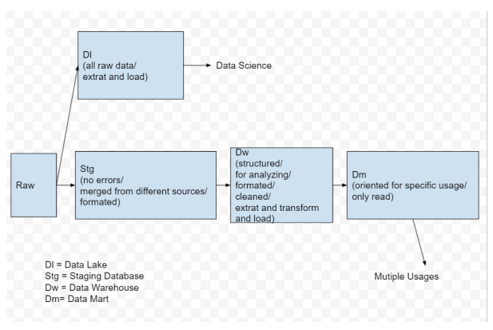

# Staging Db-Mariadb

Schema 1. run the following scripts on MariaDB Client:
Path: .\production_env\01_createdDB
a. 01 MDB DH:
device history stage b. 02_MDB_HEAL:
health relative stage c. 03_MDB_LIB:
library relative stage Data Warehouse-MS SQL Server Mgmt Studio Schema 1. run the script on MS SQL Server Mgmt Studio:
Path: *.\Hua\production_env\01_createdDB*
a. 04_SQL_DH_DW:
device history data warehouse b. 05_SQL_DW:
health+library data warehouse Satic Data 2. run the script on MS SQL Server Mgmt Studio:
Path: *.\production_env\02_staticDB*
a. 01_SQL_DHDW_Data:
static data for device history data warehouse b. 02_SQL_DW_Data:
static data for health+library data warehouse

## Data Mart-Ms Sql Server Mgmt Studio

Schema 1. run the script on MS SQL Server Mgmt Studio:
Path: *.\Hua\production_env\01_createdDB*
a. 06_SQL_DM:
health+library data mart Satic Data 2. run the script on MS SQL Server Mgmt Studio:
Path: *.\production_env\02_staticDB*
a. 03_SQL_DM_Data:
static data for health+library data warehouse
 
Hua    TCY 黃向偉

# Sql Server Agent-Ms Sql Server Mgmt Studio

a. 00_monthly_book_borrowed&total_borrower_b4 b. 01_jb_monthly_book_borrowed c. 02_jb_monthly_total_borrower d. 03_jb_monthly_book_per_person_rank e. 04_jb_book_cover f. 05_jb_rpt_book_recommendation g. 06_jb_weekly_book_borrowed h. 07_jb_weekly_total_borrower i. 08_jb_weekly_book_per_person_rank 1. run the script on MS SQL Server Mgmt Studio:
Path: *.\Hua\production_env\03_jobs* Jobs

# 03_Python File & Csv Location

Copy and paste the main_folder

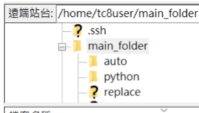

Folder:
04_mainFolder/main_folder Target path:
/home/----/
List of required csv and python files:
The ways to modify the highlighted python files will be shown in 05_Modified Python Files.

Auto:
Path: /home/----/main_folder/auto

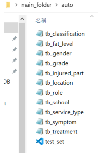

- csv -- split by 'comma' (,)
- tb_classification:
classification of books
- tb_fat_level:
student fat level
- tb_gender:
gender
- tb_grade:
student grade/ teacher/ volunteer
- tb_injured_part injured part
- tb_location:
places of school
- tb_role:
role in system
- tb_school:
school name
- tb_service_type:
internal, external and other
- tb_symptom:
internal and external symptoms
- tb_treatment treatments and actions
- python
- test_set:
generate test data for Nifi data pipeline test

### Python:

Path: /home/----/main_folder/python

#### - Python

- generator_all:
process devices history data from PostgreSQL
- replace_classification:
replace classification with its uid
- replace_transaction_type:
replace transaction type with its uid
- split_internal:
split internal care record by symptom
- split_surgery:
split surgical care record by symptom
- split_treatment:
split treatment record by treatment
- update_injured_part:
record the new inured part coming from source
- update_location:
record the new location coming from source Hua    TCY 黃向偉
- update_role:
record the new role coming from source
- update_service_type:
record the new service type coming from source
- update_symptom:
record the new symptom coming from source
- update_treatment:
record the new treatment coming from source

### Replace:

Path: /home/----/main_folder/replace

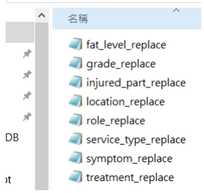

- csv -- split by 'tab' (\t)
- fat_level_replace:
store the fat level uid
- injured_part_replace:
store the injured part uid
- location_replace:
store the location uid
- role_replace:
store the role uid
- service_type_replace:
store the service type uid
 
Hua    TCY 黃向偉
- symptom_replace:
store the symptom uid
- treatment_replace:
store the treatment uid

# 04_Nifi Deployment

Hua Project Deployment Document

# Nifi Design Framework

connection setting is globally applied.

reader/writer/schema is applied module by module.

Nifi

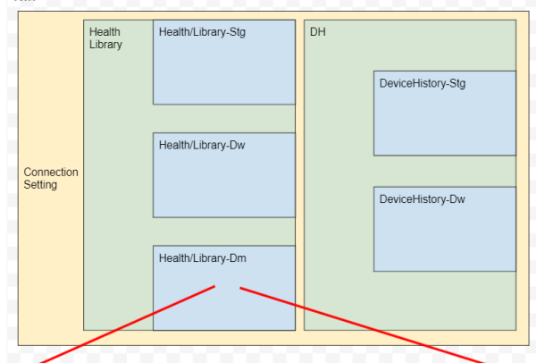

Health/Library-Dm porcess group by table

| able   |                | porcess group by function   |                |
|--------|----------------|-----------------------------|----------------|
|        | reader/writer/ |                             | reader/writer/ |
|        | schemal ...    |                             | schema/ ...    |

Hua    TCY 黃向偉

# Import Template Into Nifi

1. using PuTTy connects to VM @----

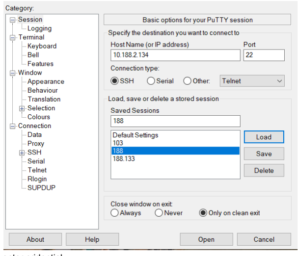

2. enter cridential:
Account: tc8user / Password: mitac@123 3. check if nifi is running:
nifi-1.10.0/bin/nifi.sh status 4. if not running:
nifi-1.10.0/bin/nifi.sh start 5. open browser and type in link:
http://10.188.2.134:8081/nifi/
6. upload template HUA_deployment.XML from folder 05_nifiTemplate Hua Project Deployment Document right click on blank space and select upload template

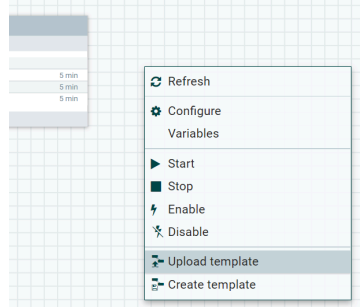

# 7.  Select Hua_Deployment.Xml And Upload

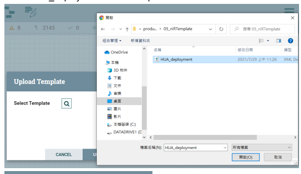

Success Template successfully imported.

OK
Hua Project Deployment Document

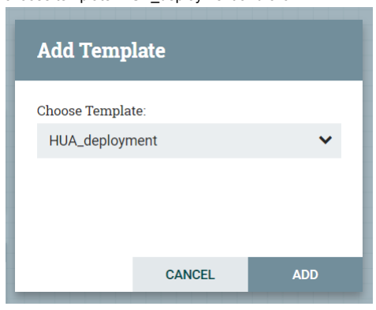

9.  choose template: HUA_deployment and click ADD
8.  drag template icon to the blank space

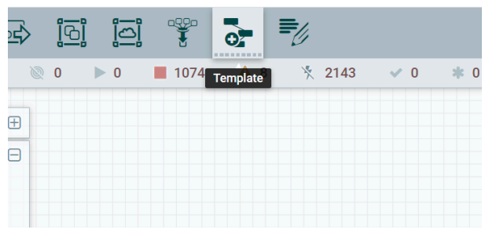

1. left click blank space and click the setting

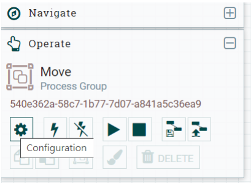

## Modify Connection Setting

10. HUA_deployment will show up

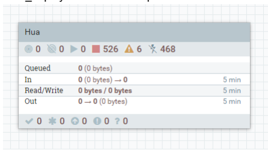

Hua Project Deployment Document 2.  click CONTROLLER SERVICES index

| Name \-          | Type                      |
|------------------|---------------------------|
| HUA_MSDB         | DBCPConnectionPool 1.10.0 |
| HUA_MSDB_DM      | DBCPConnectionPool 1.10.0 |
| HUA_MariaDB      | DBCPConnectionPool 1.10.0 |
| HUA_MariaDB_read | DBCPConnectionPool 1.10.0 |
| HUA_Maria_all    | DBCPConnectionPool 1.10.0 |
| MSDB_DH          | DBCPConnectionPool 1.10.0 |
| Maria_DH         | DBCPConnectionPool 1.10.0 |
| PSQL_DH          | DBCPConnectionPool 1.10.0 |

3. configure the connecting setting for each controller service by click the setting 4. configure Database Connection URL, Database Driver Class Name, Database Driver Location(s), Database User and Password Configure Controller Service SETTINGS
PROPERTIES

| Required field               |    |              |
|------------------------------|----|--------------|
| Property                     |    | Value        |
| Database Connection URL      | 2  | No value set |
| Database Driver Class Name   | 2  | No value set |
| Database Driver Location(s)  | ?  | No value set |
| Kerberos Credentials Service | 2  | No value set |
| Database User                | ?  | No value set |
| Password                     | 2  | No value set |

COMMENTS
5.  click apply after fill up those Properties Configure Controller Service SETTINGS
PROPERTIES
COMMENTS
Required field

|                              |    |                                                            |
|------------------------------|----|------------------------------------------------------------|
| Property                     |    | Value                                                      |
| Database Connection URL      | ?  | jdbc:sqlserver://10.188.2.132:1433;databaseName=hl ...     |
| Database Driver Class Name   | 2  | com.microsoft.sqlserver.jdbc.SQLServerDriver               |
| Database Driver Location(s)  | 2  | /home/tc8user/nifi\-1.10.0/lib/mssql\-jdbc\-9.2.0.jre8.jar |
| Kerberos Credentials Service | 2  | No value set                                               |
| Database User                | 2  | sa                                                         |
| Password                     | 2  | Sensitive value set                                        |
| Max Wait Time                | 2  | 500 millis                                                 |
| Max Total Connections        | 2  | 8                                                          |
| Validation query             | 2  | No value set                                               |
| Minimum Idle Connections     | ?  | 0                                                          |
| Max Idle Connections         | 2  | 8                                                          |
| Max Connection Lifetime      | 2  | \-1                                                        |
| Time Between Eviction Runs   | 2  | \-1                                                        |
| Minimum Fvintshla Idla Timo  | 2  | D 30 mine                                                  |

CANCEL

### 6. Enable The Controller Service

Move Configuration

#### ×

7. values for each controller service is shown below
· MSDB
ം   HUA_MSDB_DW:
health+library data warehouse in MS SQL
-   Database Connection URL:
jdbc:sqlserver://10.188.2.132:1433;databaseNam e=hlscdwdb prod Database Driver Class Name:
●
com.microsoft.sqlserver.jdbc.SQLServerDriver
- Database Driver Location(s):
/home/tc8user/nifi-1.10.0/lib/mssql-jdbc-9.2.0.jre8 .jar
- Database User:
mitacmssql
- Password:
mitac@12345

#### - Hua_Msdb_Dm:

health+library data mart in MS SQL
- Database Connection URL:
jdbc:sqlserver://10.188.2.132:1433;databaseNam e=hlscdwdb_dm_prod
- Database Driver Class Name:
com.microsoft.sqlserver.jdbc.SQLServerDriver
- Database Driver Location(s):
/home/tc8user/nifi-1.10.0/lib/mssql-jdbc-9.2.0.jre8 .jar
- Database User:
mitacmssql
- Password:
mitac@12345

#### - Msdb_Dh:

health+library data warehouse in MS SQL
- Database Connection URL:
jdbc:sqlserver://10.188.2.132:1433;databaseNam e=hlscdwdb_dh_prod
- Database Driver Class Name:
com.microsoft.sqlserver.jdbc.SQLServerDriver
- Database Driver Location(s):
/home/tc8user/nifi-1.10.0/lib/mssql-jdbc-9.2.0.jre8 .jar
- Database User:
mitacmssql
- Password:
mitac@12345

### - Mariadb

- Maria_DH:
devices history staging data in MariaDB
- Database Connection URL:
jdbc:mariadb://10.188.2.132:3306/stg_hlscdwdb_ dh_dev
- Database Driver Class Name:
org.mariadb.jdbc.Driver
- Database Driver Location(s):
/home/tc8user/nifi-1.10.0/lib/mariadb-java-client-2 .7.2.jar
- Database User:
mitacmysql
- Password:
mitac@12345
- Maria_Health_RAW:
health staging data in MariaDB
- Database Connection URL:
jdbc:mariadb://10.188.2.132:3306/db_micampus
- Database Driver Class Name:
org.mariadb.jdbc.Driver
- Database Driver Location(s):
/home/tc8user/nifi-1.10.0/lib/mariadb-java-client-2 .7.2.jar
- Database User:
mitacmysql
- Password:
mitac@12345
- Maria_Health_STG:
health staging data in MariaDB
- Database Connection URL:
jdbc:mariadb://10.188.2.132:3306/stg_micampus
- Database Driver Class Name:
org.mariadb.jdbc.Driver
- Database Driver Location(s):
/home/tc8user/nifi-1.10.0/lib/mariadb-java-client-2 .7.2.jar
- Database User:
mitacmysql
- Password:
mitac@12345
- Maria_Library_RAW:
library staging data in MariaDB
- Database Connection URL:
jdbc:mariadb://210.240.39.11:3306/
- Driver Class Name:
org.mariadb.jdbc.Driver
- Database Driver Location(s):
/home/tc8user/nifi-1.10.0/lib/mariadb-java-client-2 .7.2.jar
- Database User:
bigdata
- Password:
1qaz@WSX

#### - Maria_Library_Stg:

all raw data and staging data in MariaDB
- Database Connection URL:
jdbc:mariadb://10.188.2.132:3306/stg_interreads
- Database Driver Class Name:
org.mariadb.jdbc.Driver
- Database Driver Location(s):
/home/tc8user/nifi-1.10.0/lib/mariadb-java-client-2 .7.2.jar
- Database User:
mitacmysql
- Password:
mitac@12345

### - Postgresql

- PSQL_DH:
devices history raw data in PostgreSQL
- Database Connection URL:
jdbc:postgresql://10.188.2.133:5432/
- Database Driver Class Name:
org.postgresql.Driver
- Database Driver Location(s):
/home/tc8user/nifi-1.10.0/lib/postgresql-42.2.22.ja r
- Database User:
postgres
- Password:
mitac@123 8. close the Configuration after all the controller services are configured and enabled

# Enable All Controller Service

#### Example:

1. left click on process group DM and click the setting icon.

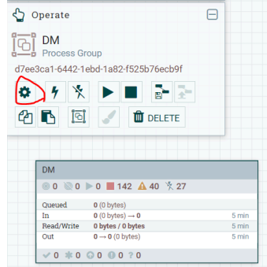

3. make necessary changes

2. click the setting button Left click on each process group and the process groups that are embedded in them and click the setting icon to enable all the controller service.

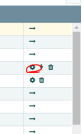

SETTINGS
PROPERTIES
COMMENTS
Required field

| Property                     |    | Value                                               |
|------------------------------|----|-----------------------------------------------------|
| Database Connection URL      | ?  | jdbc:sqlserver://10.188.2.132:1433;database ...     |
| Database Driver Class Name   | ?  | com.microsoft.sqlserver.jdbc.SQLServerDriver        |
| Database Driver Location(s)  | ?  | /home/mitac/prerequesite/Nifi/nifi\-1.10.0/lib/ ... |
| Kerberos Credentials Service | ?  | No value set                                        |
| Database User                | ?  | sa                                                  |

4.  click the lighting icon to enable the controller services

# 5.  Close The Dm Configuration Window

DM Configuration GENERA
CONTROLLER SERVICE
6.  repeat process 1-5 for all the process groups below.

All the process groups and the changes need to be made are shown below:
-  Parameter Contexts
- Click the plus sign
- Under SETTINGS tag, enter lastUpdateDate in Name,

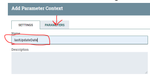

and click PARAMETERS tag.

- Click the plus sign and enter the name and check the Set empty String box, then click apply. Repeat this step for all the names below:
- careDate - itemDate - measurementDate
- Click Pareameter Contexts

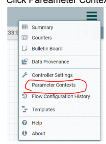

- transactinDate - treatementDate - userDate
- set value:
- max last_update_date for tables:
stg_tb_item_info/ stg_tb_transaction_info/ stg_tb_user_info in MaraiDB
- max registeredAt for tables:
stg_tb_care_data/ stg_tb_measurement_data/ stg_tb_treatment_data in MaraiDB
■

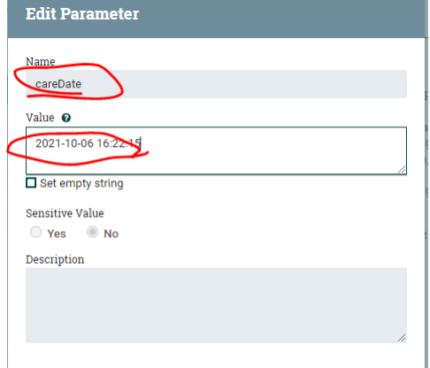

- Click apply once set up all the PARAMETERS

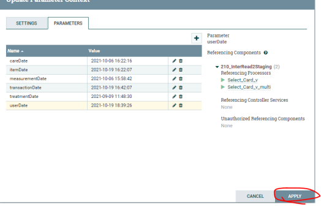

- Hua
- Modify connection setting - Connection Strings have been provided in 04_Nifi Deployment
- HuaProject/STG/132_MiHealth2Staging
- Enable all the controller service - Under general tag, change Process Group Parameter Context to lastUpdateDate
- HuaProject/STG/210_InterRead2Staging
- Enable all the controller service - Under general tag, change Process Group Parameter Context to lastUpdateDate
- DW/update_library_card_number
- Enable all the controller service
- DW/updating_users
- Enable all the controller service
- DW/updating_clinic_records
- Enable all the controller service
- DW/updating_measure_records
- Enable all the controller service
- DW/updating_treatment_records
- Enable all the controller service
- DW/updating_item_info
- Enable all the controller service
- DW/updating_transaction_info
- Enable all the controller service
- DW/test_set_dat_upload - DM
- MSDM_Language_pack
- Database Connection URL
jdbc:sqlserver://10.188.2.132:1433;databaseNam e=test4_hlscdwdb_dm_dev
- Database Driver Location(s)
/home/mitac/prerequesite/Nifi/nifi-1.10.0/lib/mssql -jdbc-9.2.0.jre8.jar
- Database User sa
- Password

#### Mitac

- Enable all the controller service
- DM/health_dimensions
- Enable all the controller service
- DM/user_info_dms
- Enable all the controller service
- DM/health_dms
- Enable all the controller service
- DM/health_dms/dm_health_record
- Enable all the controller service
- Device_dev/DW
- Enable all the controller service
- DM/library_dms
- Enable all the controller service
- DM/library_dms/dms_book
- Enable all the controller service
- DM/library_dms/dms_transaction
- Enable all the controller service
- Device_dev
- Enable all the controller service
- Device_dev/STG
- Enable all the controller service

# Set Up Python Script For Parameter Contexts

1. Copy and paste the prerequisite

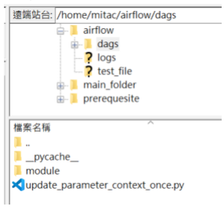

- Folder:
04_mainFolder/dags
- Target path:
/home/----/airflow/
2. Collecting the value for the following variables:
( use %40 to represent @)
- connection string for Maria_Library_RAW:
- mitacnifi:mitac%4012345@10.11.10.132
- connection string for Maria_Health_RAW
- mitacnifi:mitac%4012345@10.11.10.132
- ParameterContext_Id TCY 黄向偉

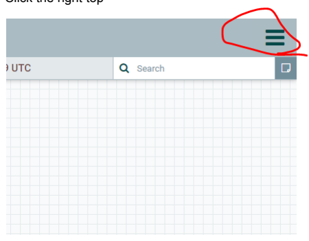

# 2.  Click Parameter Contexts

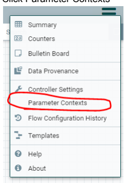

3.  Click edit for lastUpdateDate

| Name \- lastUpdateDate   | Description   |
|--------------------------|---------------|

1.  Click the right top 0 Hua    TCY 黃向偉 4. The parameter context id is under the setting tag
- STG_Process_Group_Id:

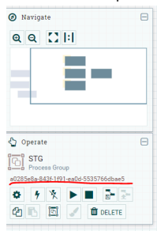

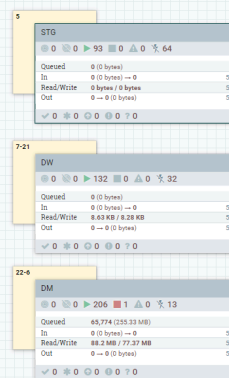

- left click on STG process group
○
- Nifi_Host:
format: Nifi's host e.g. :10.188.2.134
 
Hua    TCY 黃向偉 3. Edit Parameter Portion of the pipeline_monitor.py file under the path /home/mitac/airflow/dags/module
- e.g.

## Set Up Python Script For Nifi

1. Change the path to: /----/main_folder/replace for the files below:
update_injured_part.py update_location.py update_role.py update_service_type.py update_symptom.py update_treatment.py 2. example:

# 05_Centos**資源設定** Increase "Open Files Limit"

- Per-User Limit 1.  Open file:
sudo vi /etc/security/limits.conf 2.  Paste following towards end:
* *
 5000000 hard nofile 
* *
soft nofile 500000

|             |                                                                     | \- Udld \- Illax Udld Stze (ND)   |    |
|-------------|---------------------------------------------------------------------|-----------------------------------|----|
|             |                                                                     | \- fsize \- maximum filesize (KB) |    |
|             | \- memlock \- max locked\-in\-memory address space (KB)             |                                   |    |
|             | \- nofile \- max number of open file descriptors                    |                                   |    |
|             | \- rss \- max resident set size (KB)                                |                                   |    |
|             | \- stack \- max stack size (KB)                                     |                                   |    |
|             | \- cpu \- max CPU time (MIN)                                        |                                   |    |
|             | \- nproc \- max number of processes                                 |                                   |    |
|             | \- as \- address space limit (KB)                                   |                                   |    |
|             | \- maxlogins \- max number of logins for this user                  |                                   |    |
|             | \- maxsyslogins \- max number of logins on the system               |                                   |    |
|             | \- priority \- the priority to run user process with                |                                   |    |
|             | \- locks \- max number of file locks the user can hold              |                                   |    |
|             | \- sigpending \- max number of pending signals                      |                                   |    |
|             | \- msgqueue \- max memory used by POSIX message queues (bytes)      |                                   |    |
|             | \- nice \- max nice priority allowed to raise to values: [\-20, 19] |                                   |    |
|             | \- rtprio \- max realtime priority                                  |                                   |    |
| <domain>    | <type> <item> <value>                                               |                                   |    |
|             | soft 0                                                              | core                              |    |
|             | hard 10000                                                          | rss                               |    |
| @student    | hard 20                                                             | nproc                             |    |
| @faculty    | soft                                                                | nproc                             | 20 |
| @faculty    | hard 50                                                             | nproc                             |    |
| ftp         | hard 0                                                              | nproc                             |    |
| @student    | 4 .                                                                 | maxlogins                         |    |
|             | soft 500000                                                         | nofile                            |    |
|             | hard nofile 5000000                                                 |                                   |    |
| End of file |                                                                     |                                   |    |

3.  Once you save the file, you may need to logout and login again.

-  System-Wide Limit 1.  Open file:
sudo vi /etc/sysctl.conf

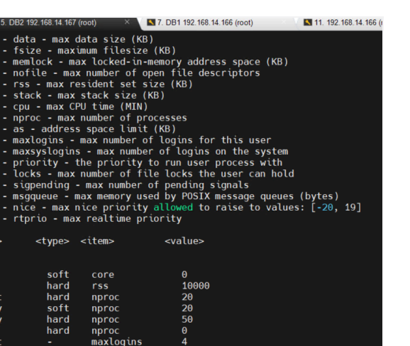

### 2.  Add Following: ❖ Fs.File-Max = 2097152

<
5. DB2 192. 168.14. 167 (root)
× 7. DB1 192. 168. 14. 166 (root)

11. 192.16

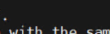

sysctl settings are defined through files in
\# /usr/lib/sysctl.d/, /run/sysctl.d/, and /etc/sysctl.d/.

\# Vendors settings live in /usr/lib/sysctl.d/.

\# To override a whole file, create a new file with the same in
\# /etc/sysctl.d/ and put new settings there. To override
\# only specific settings, add a file with a lexically later
\# name in /etc/sysctl.d/ and put new settings there.

\#
\# For more information, see sysctl.conf(5) and sysctl.d(5).

fs.file-max = 2097152 2 n n n n 3. Once you save the file, check the modification by typing:
sysctl -p 4.  Reboot the system by typing:
reboot now

# 06_Stg/Dw/Dm/Job排程

## Raw To Stg

please refer to NiFi Flow to match the names of process groups and processors.

### 132_Mihealth2Staging:

- Logic:
a. init:
get all the data from the source.

b. daily
\#where take advantage of SQL syntax "where t.lastUpdated > '\#{-----Date}'" to extract the data that had the last update date newer than the previous updating period.

#### - Targets:

the following tables in **MariaDB** will be looked into:
a. db_micampus.**treatment_data** b. db_micampus.*measurement_data* c. db_micampus.*care_data*
- Desitnation:
the following tables in **MariaDB** will be updated:
a. stg_micampus.*stg_tb_treatment_data* b. stg_micampus.*stg_tb_measurement_data* c. stg_micampus.*stg_tb_care_data*
- Frequency:
a. init:
only run once when starts a new staging db b. daily:
0 0 5 * * ?

### 210_Interread2Staging

- Logic:
a. init:
get all the data from the source.

b. daily
\#where take advantage of SQL syntax "where t.lastUpdated > '\#{XXXXXDate}'" to extract the data that had the last update date newer than the previous updating period.

- Targets:
the following tables under each school's DB in **MariaDB** will be looked into:
a. dbsettings._XXXXX.*transaction_info_vX* b. dbsettings._XXXXX.*items_info_vX* c. dbsettings._XXXXX.*patron_info*_vX
- Desitnation:
the following tables in **MariaDB** will be updated:
a. stg_micampus.*stg_tb_transaction_info* b. stg_micampus.*stg_tb_item_info* c. stg_micampus.*stg_tb_user_info*
- Frequency:
a. init:
only run once when starts a new staging db b. daily:
0 0 5 * * ?

## Stg To Dw

the assigned frequency updating_library_card_number:
- Logic:
\#except \#reference_table take advantage of SQL syntax "except" to extract the difference between MariaDB stg_interreads.stg_tb_user_info and **MariaDB** stg_interreads*.dim_tb_card_number* into the destination table in MS SQL hlscdwdb_dev.*dim_tb_card_number*, then update the reference table MariaDB stg_interreads*.dim_tb_card_number*.

- Targets:
the following table in **MariaDB** will be looked into:
a. stg_interreads.*stg_tb_user_info*
- Desitnation:
in MS SQL
a. hlscdwdb_dev.*dim_tb_card_number*
- Frequency:
0 */5 7-21 * * ?

updating_users:
- Logic:
\#except \#reference_table take advantage of SQL syntax "except" to extract the difference between MariaDB stg_interreads.stg_tb_user_info and MariaDB stg_interreads*.stg_tb_user_info_ref* into a temp table in MariaDB stg_interreads*.stg_tb_user_info_ref_temp*, insert data from the temp table into the destination table in MS SQL hlscdwdb_dev.*fat_tb_user*, then update the reference table MariaDB stg_interreads*.stg_tb_user_info_ref*.

- Targets:
the following table in **MariaDB** will be looked into:
a. stg_interreads*.stg_tb_user_info*
- Desitnation:
in **MariaDB**
a. stg_interreads*.stg_tb_user_info_ref* in MS SQL
b. hlscdwdb_dev.*fat_tb_user*
- Frequency:
0 */5 7-21 * * ?

updating_clicnic_records:

- Logic:

\#flag \#batch record the process time, extract at most 1000 rows with flag as 0 from table in MariaDB stg_micampus.*stg_tb_care_data*, assign a batch number to them, and modify the flag to 1 after selecting.

- Targets:
the following table in **MariaDB** will be looked into:
a. stg_micampus.**stg_tb_care_data**
- Desitnation:
in MS SQL
a. hlscdwdb_dev.*fat_tb_clinic_record*
- Frequency:
20 */2 7-21 * * ?

updating_measure_records:

- Logic:

\#flag \#batch record the process time, extract at most 1000 rows with flag as 0 from table in MariaDB stg_micampus.*fat_tb_health_record*, assign a batch number to them, and modify the flag to 1 after selecting.

- Targets:
the following table in **MariaDB** will be looked into:
a. stg_micampus.**stg_tb_measurement_data**
- Desitnation:
in MS SQL
a. hlscdwdb_dev.*fat_tb_health_record*
- Frequency:
20 */2 7-21 * * ?

updating_treatment_records:
- Logic:
\#flag \#batch record the process time, extract at most 1000 rows with flag as 0 from table in MariaDB stg_micampus.*stg_tb_treatment_data*, assign a batch number to them, and modify the flag to 1 after selecting.

- Targets:
the following table in **MariaDB** will be looked into:
a. stg_micampus.**stg_tb_treatment_data**
- Desitnation:
in MS SQL
a. hlscdwdb_dev.*fat_tb_treatment_record*
- Frequency:
20 */2 7-21 * * ?

updating_item_info:
- Logic:
\#flag \#batch record the process time, extract at most 1000 rows with flag as 0 from table in MariaDB stg_interreads.**stg_tb_item_info**
, assign a batch number to them, and modify the flag to 1 after selecting.

- Targets:
the following table in **MariaDB** will be looked into:
a. stg_interreads.**stg_tb_item_info**
- Desitnation:
in MS SQL
b. hlscdwdb_dev.*fat_tb_item_info*
- Frequency:
40 */2 7-21 * * ?

updating_transaction_info:
- Logic:
\#flag \#batch record the process time, extract at most 1000 rows with flag as 0 from table in MariaDB stg_interreads.*stg_tb_transaction_info*, assign a batch number to them, and modify the flag to 1 after selecting.

- Targets:
the following table in **MariaDB** will be looked into:
a. stg_interreads.*stg_tb_transaction_info*
- Desitnation:
in MS SQL
a. hlscdwdb_dev.**fat_tb_transaction_info**
- Frequency:
40 */2 7-21 * * ?

## Dw To Dm

health_dimensions.*:
- Logic:
\#except \#reference_table \#csv reading csv files into reference tables in MS SQL hlscdwdb_dm_dev, take advantage of SQL syntax "except" to extract the difference from the reference table into the destination table in MS SQL **hlscdwdb_dm_dev** then clean the reference tables.

- Targets:
the following csv files under the path /home/----/main_folder/replace on VM will be looked into:
a. injured_part_replace.csv b. location_replace.csv c. symptom_replace.csv d. treatment_replace.csv e. service_type_replace.csv
- Desitnation:
in MS SQL
a. hlscdwdb_dm_dev.*tb_role* b. hlscdwdb_dm_dev.*tb_injured_part* c. hlscdwdb_dm_dev.*tb_location* d. hlscdwdb_dm_dev.*tb_symptom* e. hlscdwdb_dm_dev.*tb_treatment* f. hlscdwdb_dm_dev.*tb_service_type*
- Frequency:
0 0 21 * * ?

user_info_dms.dms_user_info:
- Logic:
\#flag \#where extract at most 1000 rows updated at least 1 hour ago, mark the flag in the flag column **userDm** to 0, transfer to DM, and after transfering to DM modify the flag to 1.

- Targets:
the following tables in MS SQL will be looked into:
a. hlscdwdb_dev.*fat_tb_user*
- Desitnation:
in MS SQL
a. hlscdwdb_dm_dev.*dm_user_info*

#### - Frequency: 0 */2 1,2,3,4,5,6,22,23,0 * * ?

user_info_dms.card_dms:
- Logic:
\#flag \#where extract at most 1000 rows updated at least 1 hour ago, mark the flag in the flag column **cardDm** to 0, transfer to DM, and after transfering to DM modify the flag to 1.

- Targets:
the following tables in MS SQL will be looked into:
a. hlscdwdb_dev.*dim_tb_card_number*
- Desitnation:
in MS SQL
a. hlscdwdb_dm_dev.*dm_card_id*

#### - Frequency:

0 */2 **1,2,3,4,5,6,22,23,0** * * ?

health_dms.*:
- Logic:
\#check \#flag \#batch \#where record the process time, extract at most 1000 rows updated at least 1 hour ago with the minimum batchNo, mark the flag in the check table hlscdwdb_dev.*ck_tb_clinic_record* to 0, join multiple tables, transfer to DM, and after transfering to DM modify the flag to 1.

- Targets:
the following tables in MS SQL will be looked into:
a. hlscdwdb_dev.*fat_tb_health_record* b. hlscdwdb_dev.*fat_tb_clinic_record* c. hlscdwdb_dev.**fat_tb_treatment_record** d. hlscdwdb_dev.**fat_tb_user** e. hlscdwdb_dev.**dim_tb_card_number** f. hlscdwdb_dev.*fat_tb_school*
- Desitnation:
a. hlscdwdb_dm_dev.*dm_health_record* b. hlscdwdb_dm_dev.*dm_clinic_total* c. hlscdwdb_dm_dev.*dm_surgery* d. hlscdwdb_dm_dev.*dm_internal* e. hlscdwdb_dm_dev.*dm_treatment* f. hlscdwdb_dm_dev.*dm_location* g. hlscdwdb_dm_dev.*dm_student_amount*
- Frequency a. 0 0 8 * * ? for *dm_student_amount* b. 20 */1 1,2,3,4,5,6,22,23,0 * * ? for dm_health_record, dm_clinic_total, dm_surgery c. 40 */1 1,2,3,4,5,6,22,23,0 * * ? for dm_internal, dm_treatment, dm_location library_dms.dms_book:
- Logic:
\#check \#flag \#batch \#where record the process time, extract at most 1000 rows updated at least 1 hour ago with the minimum batchNo, mark the flag in the check table hlscdwdb_dev.*ck_tb_book* to 0, transfer to DM, and after transfering to DM modify the flag to 1.

- Targets:

the following tables in MS SQL will be looked into:
a. hlscdwdb_dev.*fat_tb_item_info*
- Desitnation:
in MS SQL
a. hlscdwdb_dm_dev.*dm_book*
- Frequency:
0 */1 **1,2,3,4,5,6,22,23,0** * * ?

library_dms.dms_transaction.*:

- Logic:

\#check \#flag \#batch \#where record the process time, extract at most 1000 rows updated at least 1 hour ago with the minimum batchNo, and mark the flag in the check table hlscdwdb_dev.*ck_tb_transaction* to 0 and after transfering to DM modify the flag to 1.

- Targets:

the following tables in MS SQL will be looked into:
a. hlscdwdb_dev.*fat_tb_transaction_info*
- Desitnation:
in MS SQL
a. hlscdwdb_dm_dev.*dm_transaction*
- Frequency:
0 */1 1,2,3,4,5,6,22,23,0 * * ?

Hua Project Deployment Document

# Jobs

notice that the job 00_monthly_book_borrowed/total_borrower_b4 should be manually executed on the first time the production environment is created.

# How To Execute A Job Manually:

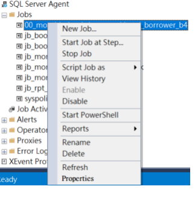

1.  right click on the target job that should be executed.

Hua Project Deployment Document 2.  click Start Job at Step..... A window will pop up like something below:

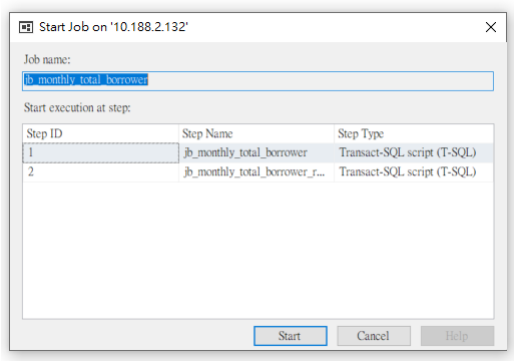

# 3. Click Start.

A window will pop up like something below.

once
- Job frequency:
4. Once the job is done.

It should look similar to the following:
00_monthly_book_borrowed&total_borrower_b4:
- Logic:
\#insert \#calculate a. rpt_monthly_book_borrowed_for_past_year:
以書本為單位,依照縣市級及鄉鎮市級分別計算過去12個月每 個月的書本總借閱次數.(e.g.一個人借三本書,**以三本計算**)
b. rpt_monthly_total_borrower_for_past_year 以借閱者為單位,依照縣市級及鄉**鎮市級分別計算過去**12個月 每個月的借閱人數.(e.g.一個人借三本書,**以一人次計算**)
- Targets:
the following table in MS SQL will be looked into:
a. hlscdwdb_dev.*vi_transaction*
- Desitnation:
in MS SQL
a. hlscdwdb_dm_dev.**rpt_monthly_book_borrowed** b. hlscdwdb_dm_dev.*rpt_monthly_total_borrower*
●
01_jb_monthly_book_borrowed:
- Logic:
\#insert \#calculate a. jb_monthly_book_borrowed:
以書本為單位,依照縣市級及鄉鎮市級分別計算過去12個月每 個月的書本總借閱次數.(e.g.一個人借三本書,**以三本計算**)
b. jb_monthly_book_borrowed_rank:
根據jb_monthly_book_borrowed 的計算結果,依照縣市級、鄉**鎮市級及校級分別計算當月的書** 本借閱次數PR值.

- Targets:
the following table in MS SQL will be looked into:
a. hlscdwdb_dm_dev*.vi_transaction* b. hlscdwdb_dm_dev*.jb_monthly_book_borrowed*
- Desitnation:
in MS SQL
a. hlscdwdb_dm_dev.**rpt_monthly_book_borrowed** b. hlscdwdb_dm_dev.*rpt_monthly_book_borrowed_rank*
- Job frequency:
06:00am on Sundays 02_jb_monthly_total_borrower:
- Logic:
\#insert \#calculate a. jb_monthly_total_borrower:
以借閱者為單位,依照縣市級及鄉**鎮市級分別計算過去**12個月 每個月的借閱者總數.(e.g.一個人借三本書,**以一人次計算**)
b. jb_monthly_total_borrower_rank:
根據jb_monthly_total_borrower_rank的計算結果,**依照縣市** 級、鄉鎮市級及校級分別計算當月的借閱者總數PR值.

#### - Targets:

the following table in MS SQL will be looked into:
a. hlscdwdb_dm_dev**.vi_transaction**
b. hlscdwdb_dm_dev*.jb_monthly_total_borrower*
- Desitnation:
in MS SQL
a. hlscdwdb_dm_dev.*rpt_monthly_total_borrower* b. hlscdwdb_dm_dev.*rpt_monthly_total_borrower_rank*
- Job frequency 06:00am on Sundays 03_jb_monthly_book_per_person_rank:
- Logic:
\#insert \#calculate a. jb_monthly_book_per_person_rank:
以鄉鎮區,縣市為基準,**分別計算最近三個月每月人均借**閱冊 數,並計算在鄉**鎮區級及縣市級的**PR值 b. jb_update_cityAmount:
計算該縣市的近三個月每月人均借閱冊數
- Targets:
the following tables in MS SQL will be looked into:
a. hlscdwdb_dm_dev.*rpt_monthly_book_borrowed* b. hlscdwdb_dm_dev.*rpt_monthly_total_borrower*
- Desitnation:
in MS SQL
a. hlscdwdb_dm_dev.*rpt_monthly_book_per_person_rank*
- Job frequency:
07:00am on Sundays 04_jb_book_cover:
- Logic:
\#insert a. insert directly from DW
- Targets:
the following table in MS SQL will be looked into:
a. testf1_hlscdwdb_dev.*dim_tb_book_cover*
- Desitnation:
in MS SQL
a. hlscdwdb_dm_dev.*dm_book_cover*
- Job frequency:
02:00am on Sundays

### 05_Jb_Book_Recommendation:

- Logic:
\#insert \#calculate a.將各校各年級的借閱紀錄(6個月內),**依照書籍類別統計借**閱 數,取借閱**數最高的前**5類 b.取全縣各年級的借閱紀錄(6個月內)中,該5**類排名第一的書**
籍(**須排除掉該校原有的書籍,只推薦該校館藏沒有的**)
- Targets:
the following table in MS SQL will be looked into:
a. hlscdwdb_dm_dev.*vi_transaction*
- Desitnation:
in MS SQL
b. hlscdwdb_dm_dev.*rpt_book_recommendation*
- Job frequency:
07:00am on Sundays 06_jb_weekly_book_borrowed:
- Logic:
\#insert \#calculate a. jb_weekly_book_borrowed:
以書本為單位,依照縣市級及鄉鎮市級分別計算過去7天書本 總借閱次數.(e.g.一個人借三本書,**以三本計算**)
b. jb_weekly_book_borrowed_rank:
根據jb_weekly_book_borrowed 的計算結果,依照縣市級、鄉**鎮市級及校級分別計算當週的書**
本借閱次數PR值.

- Targets:
the following table in MS SQL will be looked into:
a. hlscdwdb_dm_dev*.vi_transaction* b. hlscdwdb_dm_dev*.jb_weekly_book_borrowed*
- Desitnation:
in MS SQL
a. hlscdwdb_dm_dev.**rpt_weekly_book_borrowed** b. hlscdwdb_dm_dev.*rpt_weekly_book_borrowed_rank*

#### - Job Frequency:

06:00am on Sundays

### 07_Jb_Weekly_Total_Borrower:

- Logic:
\#insert \#calculate a. jb_weekly_total_borrower:
以借閱者為單位,依照縣市級及鄉**鎮市級分別計算過去**7天的 借閱者總數.(e.g.一個人借三本書,**以一人次計算**)
b. jb_weekly_total_borrower_rank:
根據jb_weekly_total_borrower_rank的計算結果,**依照縣市級、**
鄉鎮市級及校級分別計算當週的借閱者總數PR值.

- Targets:
the following table in MS SQL will be looked into:
a. hlscdwdb_dm_dev*.vi_transaction* b. hlscdwdb_dm_dev*.jb_weekly_total_borrower*
- Desitnation:
in MS SQL
a. hlscdwdb_dm_dev.*rpt_weekly_total_borrower* b. hlscdwdb_dm_dev.*rpt_weekly_total_borrower_rank*
- Job frequency 06:00am on Sundays Hua    TCY 黃向偉 08_jb_weekly_book_per_person_rank:
- Logic:
\#insert \#calculate a. **jb_week_book_per_person_rank**:
以鄉鎮區,縣市為基準,**分別計算最近一週人均借**閱冊數,並計 算在鄉**鎮區級及縣市級的**PR值

#### B. Jb_Update_Cityamount:

計算該縣市的最近一週人均借閱冊數
- Targets:
the following tables in MS SQL will be looked into:
a. hlscdwdb_dm_dev.*rpt_weekly_book_borrowed* b. hlscdwdb_dm_dev.*rpt_weekly_total_borrower*
- Desitnation:
in MS SQL
a. hlscdwdb_dm_dev.*rpt_weekly_book_per_person_rank*
- Job frequency:
07:00am on Sundays