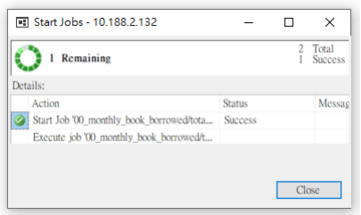
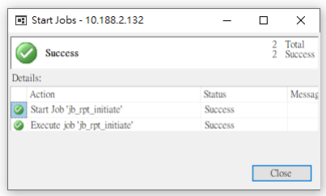

|                              |    |                                                            |
|------------------------------|----|------------------------------------------------------------|
| Property                     |    | Value                                                      |
| Database Connection URL      | ?  | jdbc:sqlserver://10.188.2.132:1433;databaseName=hl ...     |
| Database Driver Class Name   | 2  | com.microsoft.sqlserver.jdbc.SQLServerDriver               |
| Database Driver Location(s)  | 2  | /home/tc8user/nifi\-1.10.0/lib/mssql\-jdbc\-9.2.0.jre8.jar |
| Kerberos Credentials Service | 2  | No value set                                               |
| Database User                | 2  | sa                                                         |
| Password                     | 2  | Sensitive value set                                        |
| Max Wait Time                | 2  | 500 millis                                                 |
| Max Total Connections        | 2  | 8                                                          |
| Validation query             | 2  | No value set                                               |
| Minimum Idle Connections     | ?  | 0                                                          |
| Max Idle Connections         | 2  | 8                                                          |
| Max Connection Lifetime      | 2  | \-1                                                        |
| Time Between Eviction Runs   | 2  | \-1                                                        |
| Minimum Fvintshla Idla Timo  | 2  | D 30 mine                                                  |

## Dw To Dm

health_dimensions.*:
- Logic:
\#except \#reference_table \#csv reading csv files into reference tables in MS SQL hlscdwdb_dm_dev, take advantage of SQL syntax "except" to extract the difference from the reference table into the destination table in MS SQL **hlscdwdb_dm_dev** then clean the reference tables.

- Targets:
the following csv files under the path /home/----/main_folder/replace on VM will be looked into:
a. injured_part_replace.csv b. location_replace.csv c. symptom_replace.csv d. treatment_replace.csv e. service_type_replace.csv
- Desitnation:
in MS SQL
a. hlscdwdb_dm_dev.*tb_role* b. hlscdwdb_dm_dev.*tb_injured_part* c. hlscdwdb_dm_dev.*tb_location* d. hlscdwdb_dm_dev.*tb_symptom* e. hlscdwdb_dm_dev.*tb_treatment* f. hlscdwdb_dm_dev.*tb_service_type*
- Frequency:
0 0 21 * * ?

user_info_dms.dms_user_info:
- Logic:
\#flag \#where extract at most 1000 rows updated at least 1 hour ago, mark the flag in the flag column **userDm** to 0, transfer to DM, and after transfering to DM modify the flag to 1.

- Targets:
the following tables in MS SQL will be looked into:
a. hlscdwdb_dev.*fat_tb_user*
- Desitnation:
in MS SQL
a. hlscdwdb_dm_dev.*dm_user_info*

#### - Frequency: 0 */2 1,2,3,4,5,6,22,23,0 * * ?

user_info_dms.card_dms:
- Logic:
\#flag \#where extract at most 1000 rows updated at least 1 hour ago, mark the flag in the flag column **cardDm** to 0, transfer to DM, and after transfering to DM modify the flag to 1.

- Targets:
the following tables in MS SQL will be looked into:
a. hlscdwdb_dev.*dim_tb_card_number*
- Desitnation:
in MS SQL
a. hlscdwdb_dm_dev.*dm_card_id*

#### - Frequency:

0 */2 **1,2,3,4,5,6,22,23,0** * * ?

health_dms.*:
- Logic:
\#check \#flag \#batch \#where record the process time, extract at most 1000 rows updated at least 1 hour ago with the minimum batchNo, mark the flag in the check table hlscdwdb_dev.*ck_tb_clinic_record* to 0, join multiple tables, transfer to DM, and after transfering to DM modify the flag to 1.

- Targets:
the following tables in MS SQL will be looked into:
a. hlscdwdb_dev.*fat_tb_health_record* b. hlscdwdb_dev.*fat_tb_clinic_record* c. hlscdwdb_dev.**fat_tb_treatment_record** d. hlscdwdb_dev.**fat_tb_user** e. hlscdwdb_dev.**dim_tb_card_number** f. hlscdwdb_dev.*fat_tb_school*
- Desitnation:
a. hlscdwdb_dm_dev.*dm_health_record* b. hlscdwdb_dm_dev.*dm_clinic_total* c. hlscdwdb_dm_dev.*dm_surgery* d. hlscdwdb_dm_dev.*dm_internal* e. hlscdwdb_dm_dev.*dm_treatment* f. hlscdwdb_dm_dev.*dm_location* g. hlscdwdb_dm_dev.*dm_student_amount*
- Frequency a. 0 0 8 * * ? for *dm_student_amount* b. 20 */1 1,2,3,4,5,6,22,23,0 * * ? for dm_health_record, dm_clinic_total, dm_surgery c. 40 */1 1,2,3,4,5,6,22,23,0 * * ? for dm_internal, dm_treatment, dm_location library_dms.dms_book:
- Logic:
\#check \#flag \#batch \#where record the process time, extract at most 1000 rows updated at least 1 hour ago with the minimum batchNo, mark the flag in the check table hlscdwdb_dev.*ck_tb_book* to 0, transfer to DM, and after transfering to DM modify the flag to 1.

- Targets:

the following tables in MS SQL will be looked into:
a. hlscdwdb_dev.*fat_tb_item_info*
- Desitnation:
in MS SQL
a. hlscdwdb_dm_dev.*dm_book*
- Frequency:
0 */1 **1,2,3,4,5,6,22,23,0** * * ?

library_dms.dms_transaction.*:

- Logic:

\#check \#flag \#batch \#where record the process time, extract at most 1000 rows updated at least 1 hour ago with the minimum batchNo, and mark the flag in the check table hlscdwdb_dev.*ck_tb_transaction* to 0 and after transfering to DM modify the flag to 1.

- Targets:

the following tables in MS SQL will be looked into:
a. hlscdwdb_dev.*fat_tb_transaction_info*
- Desitnation:
in MS SQL
a. hlscdwdb_dm_dev.*dm_transaction*
- Frequency:
0 */1 1,2,3,4,5,6,22,23,0 * * ?

Hua Project Deployment Document

# 3. Click Start.

A window will pop up like something below.

once
- Job frequency:
4. Once the job is done.

It should look similar to the following:
00_monthly_book_borrowed&total_borrower_b4:
- Logic:
\#insert \#calculate a. rpt_monthly_book_borrowed_for_past_year:
以書本為單位,依照縣市級及鄉鎮市級分別計算過去12個月每 個月的書本總借閱次數.(e.g.一個人借三本書,**以三本計算**)
b. rpt_monthly_total_borrower_for_past_year 以借閱者為單位,依照縣市級及鄉**鎮市級分別計算過去**12個月 每個月的借閱人數.(e.g.一個人借三本書,**以一人次計算**)
- Targets:
the following table in MS SQL will be looked into:
a. hlscdwdb_dev.*vi_transaction*
- Desitnation:
in MS SQL
a. hlscdwdb_dm_dev.**rpt_monthly_book_borrowed** b. hlscdwdb_dm_dev.*rpt_monthly_total_borrower*
●
01_jb_monthly_book_borrowed:
- Logic:
\#insert \#calculate a. jb_monthly_book_borrowed:
以書本為單位,依照縣市級及鄉鎮市級分別計算過去12個月每 個月的書本總借閱次數.(e.g.一個人借三本書,**以三本計算**)
b. jb_monthly_book_borrowed_rank:
根據jb_monthly_book_borrowed 的計算結果,依照縣市級、鄉**鎮市級及校級分別計算當月的書** 本借閱次數PR值.

- Targets:
the following table in MS SQL will be looked into:
a. hlscdwdb_dm_dev*.vi_transaction* b. hlscdwdb_dm_dev*.jb_monthly_book_borrowed*
- Desitnation:
in MS SQL
a. hlscdwdb_dm_dev.**rpt_monthly_book_borrowed** b. hlscdwdb_dm_dev.*rpt_monthly_book_borrowed_rank*
- Job frequency:
06:00am on Sundays 02_jb_monthly_total_borrower:
- Logic:
\#insert \#calculate a. jb_monthly_total_borrower:
以借閱者為單位,依照縣市級及鄉**鎮市級分別計算過去**12個月 每個月的借閱者總數.(e.g.一個人借三本書,**以一人次計算**)
b. jb_monthly_total_borrower_rank:
根據jb_monthly_total_borrower_rank的計算結果,**依照縣市** 級、鄉鎮市級及校級分別計算當月的借閱者總數PR值.

#### - Targets:

the following table in MS SQL will be looked into:
a. hlscdwdb_dm_dev**.vi_transaction**
b. hlscdwdb_dm_dev*.jb_monthly_total_borrower*
- Desitnation:
in MS SQL
a. hlscdwdb_dm_dev.*rpt_monthly_total_borrower* b. hlscdwdb_dm_dev.*rpt_monthly_total_borrower_rank*
- Job frequency 06:00am on Sundays 03_jb_monthly_book_per_person_rank:
- Logic:
\#insert \#calculate a. jb_monthly_book_per_person_rank:
以鄉鎮區,縣市為基準,**分別計算最近三個月每月人均借**閱冊 數,並計算在鄉**鎮區級及縣市級的**PR值 b. jb_update_cityAmount:
計算該縣市的近三個月每月人均借閱冊數
- Targets:
the following tables in MS SQL will be looked into:
a. hlscdwdb_dm_dev.*rpt_monthly_book_borrowed* b. hlscdwdb_dm_dev.*rpt_monthly_total_borrower*
- Desitnation:
in MS SQL
a. hlscdwdb_dm_dev.*rpt_monthly_book_per_person_rank*
- Job frequency:
07:00am on Sundays 04_jb_book_cover:
- Logic:
\#insert a. insert directly from DW
- Targets:
the following table in MS SQL will be looked into:
a. testf1_hlscdwdb_dev.*dim_tb_book_cover*
- Desitnation:
in MS SQL
a. hlscdwdb_dm_dev.*dm_book_cover*
- Job frequency:
02:00am on Sundays

### 05_Jb_Book_Recommendation:

- Logic:
\#insert \#calculate a.將各校各年級的借閱紀錄(6個月內),**依照書籍類別統計借**閱 數,取借閱**數最高的前**5類 b.取全縣各年級的借閱紀錄(6個月內)中,該5**類排名第一的書**
籍(**須排除掉該校原有的書籍,只推薦該校館藏沒有的**)
- Targets:
the following table in MS SQL will be looked into:
a. hlscdwdb_dm_dev.*vi_transaction*
- Desitnation:
in MS SQL
b. hlscdwdb_dm_dev.*rpt_book_recommendation*
- Job frequency:
07:00am on Sundays 06_jb_weekly_book_borrowed:
- Logic:
\#insert \#calculate a. jb_weekly_book_borrowed:
以書本為單位,依照縣市級及鄉鎮市級分別計算過去7天書本 總借閱次數.(e.g.一個人借三本書,**以三本計算**)
b. jb_weekly_book_borrowed_rank:
根據jb_weekly_book_borrowed 的計算結果,依照縣市級、鄉**鎮市級及校級分別計算當週的書**
本借閱次數PR值.

- Targets:
the following table in MS SQL will be looked into:
a. hlscdwdb_dm_dev*.vi_transaction* b. hlscdwdb_dm_dev*.jb_weekly_book_borrowed*
- Desitnation:
in MS SQL
a. hlscdwdb_dm_dev.**rpt_weekly_book_borrowed** b. hlscdwdb_dm_dev.*rpt_weekly_book_borrowed_rank*

#### - Job Frequency:

06:00am on Sundays

### 07_Jb_Weekly_Total_Borrower:

- Logic:
\#insert \#calculate a. jb_weekly_total_borrower:
以借閱者為單位,依照縣市級及鄉**鎮市級分別計算過去**7天的 借閱者總數.(e.g.一個人借三本書,**以一人次計算**)
b. jb_weekly_total_borrower_rank:
根據jb_weekly_total_borrower_rank的計算結果,**依照縣市級、**
鄉鎮市級及校級分別計算當週的借閱者總數PR值.

- Targets:
the following table in MS SQL will be looked into:
a. hlscdwdb_dm_dev*.vi_transaction* b. hlscdwdb_dm_dev*.jb_weekly_total_borrower*
- Desitnation:
in MS SQL
a. hlscdwdb_dm_dev.*rpt_weekly_total_borrower* b. hlscdwdb_dm_dev.*rpt_weekly_total_borrower_rank*
- Job frequency 06:00am on Sundays Hua    TCY 黃向偉 08_jb_weekly_book_per_person_rank:
- Logic:
\#insert \#calculate a. **jb_week_book_per_person_rank**:
以鄉鎮區,縣市為基準,**分別計算最近一週人均借**閱冊數,並計 算在鄉**鎮區級及縣市級的**PR值

#### B. Jb_Update_Cityamount:

計算該縣市的最近一週人均借閱冊數
- Targets:
the following tables in MS SQL will be looked into:
a. hlscdwdb_dm_dev.*rpt_weekly_book_borrowed* b. hlscdwdb_dm_dev.*rpt_weekly_total_borrower*
- Desitnation:
in MS SQL
a. hlscdwdb_dm_dev.*rpt_weekly_book_per_person_rank*
- Job frequency:
07:00am on Sundays