# Buffering Database Operations For Enhanced Instruction Cache Performance

Jingren Zhou Columbia University jrzhou@cs.columbia.edu

## Abstract

As more and more query processing work can be done in main memory, memory access is becoming a significant cost component of database operations. Recent database research has shown that most of the memory stalls are due to second-level cache data misses and first-level instruction cache misses. While a lot of research has focused on reducing the data cache misses, relatively little research has been done on improving the instruction cache performance of database systems. We first answer the question "Why does a database system incur so many instruction cache misses?" We demonstrate that current demand-pull pipelined query execution engines suffer from significant instruction cache thrashing between different operators. We propose techniques to buffer database operations during query execution to avoid instruction cache thrashing. We implement a new light-weight "buffer" operator and study various factors which may affect the cache performance. We also introduce a plan refinement algorithm that considers the query plan and decides whether it is beneficial to add additional "buffer" operators and where to put them. The benefit is mainly from better instruction locality and better hardware branch prediction. Our techniques can be easily integrated into current database systems without significant changes. Our experiments in a memory-resident PostgreSQL database system show that buffering techniques can reduce the number of instruction cache misses by up to 80% and improve query performance by up to 15%.

## 1. Introduction

As random access memory gets cheaper and new 64-bit CPUs join the PC family, it becomes affordable and feasible to build computers with large main memories. More and more query processing work can be done in main memory. On the other hand, recent advances in the speed of commod- ∗This research was supported by NSF grants IIS-01-20939, and EIA-00-91533.

Permission to make digital or hard copies of all or part of this work for personal or classroom use is granted without fee provided that copies are Kenneth A. Ross ∗
Columbia University kar@cs.columbia.edu ity CPUs have far outpaced advances in memory latency. Main memory access is becoming a significant - if not the major - cost component of database operations [3, 6]. Recent database research has demonstrated that the dominant memory stalls are due to the data cache misses on the second-level cache and the instruction cache misses on the first-level instruction cache [3, 20, 22]. A flurry of recent research has focused on reducing the data cache misses in database systems, such as designing new cache-conscious algorithms [29, 6, 33], new cache-conscious index structures [26, 27, 18, 8, 9] and new data storage models [2]. However, relatively little research has been done on improving the instruction cache performance. As demonstrated in [3, 20, 17, 5], database workloads exhibit instruction footprints that are much larger than the first-level instruction cache. A conventional demand-pull query execution engine generates a long pipeline of execution operators. In this model, an operator returns control to its parent operator immediately after generating one tuple. The instructions for this operator get evicted from the cache to empty cache memory space for the parent operator. However, the evicted instructions are required when generating the next tuple, and have to be loaded into the cache again. The resulting instruction cache thrashing may reduce the overall query performance significantly. In this paper, we focus on improving the instruction cache performance for conventional demand-pull database query engines. We aim to achieve fast query execution throughput. At the same time, we do not want to make substantial modifications to the existing database implementations. Given a query plan we add a special "buffer" operator in certain places between a parent operator and a child operator. During query execution, each buffer operator stores a large array of pointers to intermediate tuples generated by the child operator. Rather than returning control to the parent operator after one tuple, the buffer operator fills its array with intermediate results by repeatedly calling the child operator. Control returns to the parent operator once the buffer's array is filled (or when there are no more tuples). When the parent operator requests additional tuples, they are returned from the buffer's array without executing any code from the child operator.

191 The net effect of this approach is that parent and child oper-

not made or distributed for profit or commercial advantage, and that copies bear this notice and the full citation on the first page. To copy otherwise, to republish, to post on servers or to redistribute to lists, requires prior specific permission and/or a fee. SIGMOD 2004 June 13-18, 2004, Paris, France.

Copyright 2004 ACM 1-58113-859-8/04/06 . . . $5.00.
192

#### Figure 1: Operator Execution Sequence

ators are no longer interleaved. The child operator is called repeatedly, until the buffer is full, then the parent operator is called repeatedly, until the buffer is empty. This change is illustrated in Figure 1 with a buffer size of 5 tuples. A P denotes an execution of the parent operator code, while a C denotes an execution of the child operator code. The interleaving of the parent and child operators causes instruction-cache interference, and instruction cache thrashing when the combined size of the two operators exceeds the size of the smallest, fastest cache unit. By changing the execution pattern to that of Figure 1(b), we can ensure that at least four out of every five executions of an operator find the operator's code cache resident, assuming that the operator fits within the smallest, fastest cache unit. In the event that multiple consecutive operators in the pipeline can fit in the cache, we buffer once above the group of operators, rather than above each operator in the group. While there is extra handling for the new buffer operators, we expect to benefit from improved instruction spatial and temporal locality, and thus to incur a smaller number of instruction cache misses. We demonstrate experimentally that in some situations there is a net benefit to buffering. Buffering query execution is not always beneficial. The decision is based on the interaction between consecutive operators and depends on the properties of related operators (such as cardinality estimates from the optimizer, etc.). We introduce a plan refinement algorithm that infers the instruction footprints and decides whether query execution needs to be buffered and where to buffer. We study various factors that affect cache performance and provide architecture-sensitive guidelines for choosing buffering parameters. We built an experimental prototype on top of the PostgreSQL database system [31]. PostgreSQL implements a large variety of database operations. During execution, the executor processes a tree of "plan nodes". The plan tree is essentially a demand-driven pipeline of tuple processing operations. Each node, when called, will produce the next tuple in its output sequence, or NULL if no more tuples are available. If the node is not a primitive relation-scanning node, it will have child node(s) that it calls in turn to obtain input tuples. Our results show that conventional demand-pull pipelined query execution has a high instruction cache miss rate. By simply adding additional buffer operators, we can reduce the number of instruction cache misses by up to 80%. As a side effect, buffering also improves the accuracy of hardware branch prediction and decreases the number of branch mispredictions. Overall, our techniques improve the query performance by up to 15% over a memory-resident database. The rest of this paper is organized as follows. We discuss related work in Section 2. We briefly discuss hierarchical memory systems in Section 3. We describe the conventional demand-driven pipelined query execution engine and demonstrate why it is suboptimal for instruction cache performance in Section 4. In Section 5, we present a new buffer operator and the detailed data structures. We derive guidelines for when and where to place buffer operators in Section 6. In Section 7, we present detailed experiments and validate our algorithms. We conclude in Section 8.

## 2. Related Work

Compilers may contain schemes to improve instruction cache performance. A code layout algorithm is proposed in [23], which uses profile guided feedback information to contiguously layout the sequence of basic blocks that lie on the most commonly occurring control flow path. Gloy et al. extend the algorithm to consider the temporal relationship between procedures in addition to the target cache information and the size of each procedure [10]. A cache line coloring algorithm inspired by the register coloring technique is proposed in [13] to reduce the number of conflict misses in the instruction cache. Similar code layout techniques are used for both decision support and OLTP workloads in [24, 25] to improve instruction fetch bandwidth. Several techniques for non-sequential instruction prefetching are proposed in [30, 7, 19]. Prefetch instructions are inserted by the compiler to prefetch branch targets. Previous work [4] presented a hardware mechanism to implement call graph prefetching. This scheme analyzes the call graph of a database system and prefetches instructions from the function that is deemed likely to be called next. Although the list of references presented here is not exhaustive, it is representative of techniques proposed to improve instruction cache performance at the compiler level. For database systems, however, these techniques do not solve the fundamental problem: large instruction footprints during database query execution, leading to a large number of instruction cache misses. The challenge is to reduce the effective size of the query execution footprints without sacrificing performance. Since the programming-language compiler is not invoked for each new query, one must try to resolve the issue at the "query compiler" level, i.e., during query optimization. A block oriented processing technique for aggregation, expression evaluation and sorting operations is proposed in [21]. Each operation is performed on a block of records using a vector style processing strategy to achieve better instruction pipelining and minimize instruction count and function calls.

The impact of instruction cache performance is not studied. Function calls are cheap if the instructions are found already in the first-level cache, compared with instruction cache misses. Further, their techniques require a complete redesign of database operations so that all operations return blocks of tuples. Finally, the techniques of [21] do not consider the operator footprint size when deciding whether to process data in blocks. As a result, it is possible that "too much" block-oriented processing takes place. Zhou and Ross use a similar buffer strategy to batch accesses to a tree-based index [33]. The performance benefits of such buffering are due primarily to improved data cache hit rates. The impact of buffering on instruction-cache behavior is not described.

## 3. Memory Hierarchy

Modern computer architectures have a hierarchical memory system, where access by the CPU to main memory is accelerated by various levels of cache memories. Cache memories are designed based on the principles of *spatial* and temporal locality. A *cache hit* happens when the requested data (or instructions) are found in the cache. Otherwise, the CPU loads data (or instructions) from a lower-level cache or memory, and incurs a *cache miss*. There are typically two or three cache levels. The first level (L1) cache and the second level (L2) cache are often integrated on the CPU's die. Instruction and data caches are usually separated in the first level and are shared in the second level. Caches are characterized by three major parameters: capacity, cacheline size, and associativity. Latency is the time span that passes after issuing a data access until the requested data is available in the CPU. In hierarchical memory systems, the latency increases with the distance from the CPU. Figure 2 shows cache memory systems for Pentium 4. In this paper, we will be looking to minimize L1 instruction cache misses. While L2 cache sizes are expected to increase with future generations of machines, the L1 cache sizes will probably not increase at nearly the same rate. Larger L1 caches are slower than smaller L1 caches, and may slow down the processor clock [3].

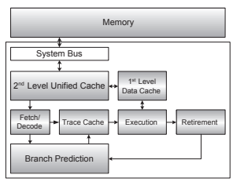

Figure 2: Pentium 4 Cache Memories

193 To decode instructions faster, modern processors (like the Pentium 4) implement a Trace Cache [14, 16], instead of a conventional L1 instruction cache. The Trace Cache stores decoded micro-operations and delivers them to the out-oforder execution logic. Most instructions in a program are fetched and executed from the Trace Cache. Upon a trace cache miss, the instruction address is submitted to the instruction translation lookaside buffer (ITLB), which translates the address into a physical memory address before the cache lookup is performed. An ITLB miss requires memory accesses to the OS page directory and tables in order to translate the address. Given the physical memory address, the architecture fetches and decodes the instruction from the L2 cache. Unlike data cache miss latency, instruction cache miss latency is difficult to overlap, because L1 instruction cache misses cause a serial bottleneck in the pipeline.

| CPU                          | Pentium 4 1.8 GHz         |
|------------------------------|---------------------------|
| OS                           | Redhat 7.3 (Linux 2.4.18) |
| Main\-memory size            | 1 GB RDRAM                |
| Trace Cache                  | 12 K micro\-ops           |
| ITLB                         | 128 entries               |
| L1 data cache size           | 16 KB                     |
| L1 data cacheline size       | 64 bytes                  |
| L2 cache size                | 256 KB                    |
| L2 cacheline size            | 128 bytes                 |
| Trace Cache miss latency     | > 27 cycles               |
| L1 data miss latency         | 18 cycles                 |
| L2 miss latency              | 276 cycles                |
| Branch misprediction latency | > 20 cycles               |
| Hardware prefetch            | Yes                       |
| C Compiler                   | GNU's gcc 3.2             |

#### Table 1: System Specifications

In modern processors, data memory latency can be hidden by correctly prefetching data into the cache. On some architectures, such as the Pentium 4, common access patterns like sequential access are recognized by the hardware, and hardware prefetch instructions are automatically executed ahead of the current data references, without any explicit instructions required from the software. Conditional branch instructions present another significant problem for modern pipelined CPUs because the CPUs do not know in advance which of the two possible outcomes of the comparison will happen. CPUs try to *predict* the outcome of branches, and have special hardware for maintaining the branching history of many branch instructions. For Pentium 4 processors, the trace cache integrates branch prediction into the instruction cache by storing traces of instructions that have previously been executed in sequence, including branches. The same cache line can include both a branch and its target, with a zero penalty for executing the branch along the predicted direction. The pipeline for a Pentium 4 is 20 stages deep, and the minimal branch misprediction penalty is at least 20 cycles [14].

Table 1 lists the specifications of our experimental system.1 The 12K µops Trace Cache has a similar hit rate to an 8K
to 16K byte conventional instruction cache [14]. We are unable to measure the trace cache miss latency directly. Besides loading the instruction from the L2 cache, we assume that at least one extra cycle is spent on decoding the instruction, two cycles are spent for each of the two queues before instruction decoding and the trace cache, and another four cycles are needed to reinitialize the pipeline [14]. We add up these costs to obtain the lower bound for trace cache miss latency. In our experimental results that measure the relative importance of branch misprediction effects, we assume that a branch misprediction incurs a 20 cycle delay. Even though the latencies are approximate, they can give us a sense of the relative contribution of different kinds of stalls.

## 4. Pipelined Query Execution

A demand-driven pipelined query execution model is used by most commercial systems and by research projects such as System R [28], Starburst [12] and Volcano [11]. A thor1We use LMbench [1] to measure the L1 and L2 latency.

ough survey can be found in [11]. In this method, each operator supports an open-next-close iterator interface. The open() function initializes the state of the iterator by allocating buffers for its inputs and output, and is also used to pass in arguments such as selection predicates that modify the behavior of the operator. The next() function calls the next() function on each input node recursively and processes the input tuples until one output tuple is generated. The state of the operator is updated to keep track of how much input has been consumed. When all output tuples have been produced through repeated calls to the next() function, the close() function deallocates the state information and performs final housekeeping. The iterator interface supports pipelining of results naturally. The decision to pipeline or materialize input tuples is encapsulated in the operator-specific code that processes input tuples. Pipelining requires much less space for intermediate results during execution. As pointed out in [11], demand-pull pipelined query execution model can be executed by a single process or thread. This approach has several advantages such as avoiding inter-process communication between operators, avoiding process synchronization and scheduling, minimizing data copies, keeping only the current data items in memory, and performing lazy operator evaluation. However, as for the instruction cache performance, demanddriven pipelined query plans exhibit poor instruction locality and have bad instruction cache behavior. For a query plan with a pipeline of operators, all the operators' instructions on the pipeline must be executed at least once to generate one output tuple. Most database operators have fairly complex implementations. Therefore, the query execution shows large instruction footprints, as confirmed in [3, 20].

If the instruction cache is smaller than the total instruction footprint, every operator finds that some of its instructions are not in the cache. By loading its own instructions into the instruction cache, capacity cache misses occur to evict instructions for other operators from the cache. However, the evicted instructions are required by subsequent requests to the operators, and have to be loaded again in the future. This happens for every output tuple and for every operator in the pipeline. The resulting *instruction cache thrashing* can have a severe impact on the overall performance. A less obvious deficiency of the current query execution model is a large number of branch mispredictions. Each operator checks for nullability, datatypes, comparison, overflow, underflow, error conditions, etc. per record. Correct branch predictions are based on the previous branch history. If the pipeline is long, the CPU must keep track of histories of a large number of branches. If the total number of branches exceeds the capacity of the hardware (usually between 512 and 4K branch instructions) then the branchhistory unit may thrash. Additionally, different database operators often share common functions. These functions may have different branching patterns when called by different operators. Executing the whole pipeline of operators together mixes different branch patterns and reduces branch prediction accuracy. We illustrate instruction cache thrashing by executing a sim-
SELECT SUM(l_extendedprice *
(1 - l_discount) *
(1 + l_tax)) as sum_charge, AVG(l_quantity) as avg_qty, COUNT(*) as count_order FROM lineitem WHERE l_shipdate <= date '1998-11-01';
Figure 3: Query 1 ple example query based on the TPC-H schema [32]. The SQL query is shown in Figure 3. This pricing summary report query provides a summary pricing report for all lineitems shipped on a given date. The query lists totals for discounted extended price plus tax and average quantity. The Postgres query execution plan contains an "Aggregation" operator above a "TableScan" operator over the "lineitem" table. This kind of plan would be typical of most database systems. Within the "TableScan" operator, the predicate on shipdate is evaluated and projection is performed on satisfied tuples. The query is executed on a TPC-H benchmark database with factor 0.2 in Postgres. We exclude effects from the I/O system by using a large buffer pool and by keeping the table "lineitem" in memory.

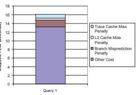

El nds
)

Figure 4: Instruction Cache Thrashing Impact

Figure 4 shows the breakdown results for the simple example query. Modern machines have hardware performance counters to measure such statistics without any loss in performance.2 We explicitly measure the number of L1 instruction cache (trace cache) misses and L2 unified cache misses during the execution. Most of the L2 cache misses are data cache misses. The impact of L1 data cache misses are rather small and we don't report them in this paper. In the graph we show the "cache miss penalty" as the total time taken if each cache miss takes exactly the measured cache miss latency. This is an approximation for the data cache miss penalty because some computation may be happening during the data cache miss wait time, and so the "L2 data cache miss penalty" bar on the graph may also hide some concurrent computation. The L1 instruction cache miss penalty is also an approximation (an underestimate) because we use the lower bound of its latency in Section 3. We also explicitly measure the number of mispredicted branches and calculate the penalty. Despite these caveats, the performance graph aps ed Ti me
 (
se c o

2We use the Intel VTune Performance Tool [15] to measure hardware counters in this paper.

194
will give us a sense of the contribution of cache-related latency to the overall response time, and thus the opportunity for improvement by processing query in batches. For this simple query, the first-level instruction cache miss penalty represents a fair proportion of the total time. By reducing the instruction cache misses, we expect to reduce ITLB misses and possibly improve hardware branch predictions. There is thus an opportunity for improving the instruction cache behavior.

## 5. A New Buffer Operator

To avoid the instruction cache thrashing problem, we propose implementing a new light-weight buffer operator using the conventional iterator interface. A buffer operator simply batches the intermediate results of the operator(s) below it. We do not require modifications to the implementations of any existing operators. Given a query execution plan, we first organize the tree of operators into *execution groups*. Execution groups are candidate units of buffering (batching). We explicitly add a new buffer operator *above* each execution group if buffering is necessary. An execution group may be a single operator, or may contain several consecutive operators in the pipeline. Larger execution groups correspond to doing less buffering. For now, we assume that the mapping from a query plan to a tree of execution groups is given, and defer the discussion of how to choose execution groups until Section 6.

The new buffer operator supports the open-next-close interface. Both open() and close() functions are simple. They allocate/deallocate an array of tuple pointers and local buffering state information. Figure 6 show the pseudocode of the GetNext() function for buffer operators. A buffer operator maintains two states: whether end-of-tuples is received from the child operator and whether its buffered tuples have been consumed. Like other operators, when the GetNext() function of a buffer operator is called for the first time, it begins to retrieve a tuple from the child operator. However, instead of returning the tuple immediately, a buffer operator saves the pointer to the previous tuple and continues to retrieve another tuple. A buffer operator won't return any tuple until either end-of-tuples is received from the child operator or it collects a full array of tuples. Subsequent requests will be filled directly from its buffered array until all the buffered tuples have been consumed and the operator begins to retrieve another array of tuples.

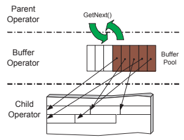

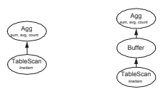

(a) Original Plan (b) Buffered Plan

195

Figure 5: Query Execution Plan

Figure 5(a) shows the original query plan of the example query in Section 4. Both "Aggregation" and "TableScan" operators represent an execution group individually. Figure 5(b) shows the buffered plan formed by adding a buffer operator between the two execution groups. There is no need to put another buffer operator above the top operator because the output tuples are sent to the client directly. Note that we don't change the original operators.

GetNext()
1 if *empty* and !end of *tuples* 2 **then while** !*full*

3 do child. GetNext()

 $\begin{array}{l}\texttt{.....}\texttt{Current}\left(1\right)\\ \textit{end of tuples}\\ \texttt{then}\texttt{break}\\ \texttt{else}\texttt{}\texttt{}\texttt{store the p}\end{array}$
4 if end of *tuples*
5 **then break**
6 **else** store the pointer to the tuple 7 **return** the next pointed tuple Figure 6: Pseudocode for Buffer Operator

#### Figure 7: Buffer Operator

Figure 7 shows a buffer operator with size 8. The operator maintains a buffer array which stores pointers to previous intermediate tuples from the child operator. Tuples stay in the child operator's memory space.3 Subsequent requests to the GetNext() function can be answered by returning the tuple pointed to by the top pointer in the array. The point of buffering is that it increases temporal and spatial instruction locality below the buffer operator. When the child operator is executed, its instructions are loaded into the L1 instruction cache. Instead of being used to generate one tuple, these instructions are used to generate many tuples. As a result, the memory overhead for bringing the instructions into the cache and the CPU overhead of decoding the instructions is smaller, amortized over many tuples. Since this memory latency is a noticeable component of the 3In Postgres, an operator generates a tuple in a heap within the operator's memory space. The responsibility for deallocating this tuple when it is no longer needed is delegated to the parent (or an ancestor) operator. In principle, no matter where the tuples stay, the buffer operator only maintains tuple pointers and requires the buffered tuples not to be deallocated until consumed by the parent operator. If a query engine was implemented in such a way that operators could store only one intermediate tuple at a time, then our buffer structure would have to copy the tuple, rather than a pointer to the tuple, and incur some additional overhead.

total cost, buffering can improve the *query throughput*, i.e., the rate at which the result is processed. Another possible benefit of buffering is better hardware branch prediction. By repeatedly executing the child operator, the pattern of branching for a shared piece of code displays more temporal predictability. Hence, the hardware branch prediction accuracy is improved. An important aspect of a buffer operator is that *it does not* copy tuples from the child operator, as shown in Figure 7. The overhead of copying would reduce the benefit of buffering instructions. The space overhead for a buffer operator is low, but it requires more space from the child operator to store the intermediate tuples. As we shall see in Section 7, the overhead of implementing a buffer operator is small. The choice of buffer size can be important. As the buffer size increases, fewer instruction cache misses occur, due to the improved instruction locality. On the other hand, larger buffers require more memory to store the intermediate tuples and could incur more L2 data cache misses. We investigate this issue experimentally in Section 7.4.

## 6. Buffering Strategies

We now address the question of where to add buffer operators. Every buffer operator incurs the cost of maintaining operator state and pointers to tuples during execution. If this cost is significant compared with the performance gain from better instruction locality, then there is a potential for "too much" buffering. On the other hand, if the total footprint of an execution group is larger than the L1 instruction cache, then repeatedly generating tuples may incur a large number of instruction cache misses. Thus there is also a potential for "too little" buffering. (The original query execution plan for Query 1 in Figure 3 can be seen as an example of "too little" buffering.) Operators with small cardinality estimates are unlikely to benefit from putting new buffer operators above them. For example, in a foreign-key index-nested-loop join, the inner index scan operator is executed only once for each outer tuple. The costs of buffering probably outweigh the benefits in such a case. We thus exclude operators with small cardinality estimates from being part of any execution group. The cardinality threshold at which the benefits outweigh the costs can be determined using a calibration experiment on the target architecture. This threshold can be determined once, in advance, by the database system. The calibration experiment would consist of running a single query with and without buffering at various cardinalities. Query 1 would be a good choice of calibration query because the child operator and the parent operator each fit in the L1 instruction cache, while the combination of the two exceeds the L1 instruction cache. The cardinality at which the buffered plan begins to beat the unbuffered plan would be the cardinality threshold for buffering. We empirically investigate the effect of cardinality in detail in Section 7.3. While buffering is useful for an operator pipeline, there are some operators, such as sorting and hash-table building, that break the pipeline. A complete execution of the child operator is needed before the parent operator can progress. In essence, these operators already buffer query executions below them. There is no need to put blocking operators within any execution groups. Ideally, one would like to come up with a cost-based way of estimating the expense of adding additional buffer operators to a query pipeline. We illustrate such an approach based on the L1 instruction cache size in Section 6.1. In Section 6.2 we introduce a plan refinement algorithm that refines query plans produced by the optimizer so as to add buffer operators as necessary.

## 6.1 Instruction Footprint Analysis

196 The basic strategy is to break a pipeline of operators into execution groups so that the instruction footprint of each execution group combined with the footprint of a new buffer operator is less than the L1 instruction cache size. By doing so, we expect to eliminate instruction cache thrashing within an execution group. Therefore, we need to be able to accurately estimate the effective footprint of query operators and execution groups. The naive way to estimate footprint size is to statically study the source code to generate static call graphs. The binary sizes of database functions can be computed after compilation. Then, for each module, we could sum up the sizes of all the functions that are *possibly* called within this module as its instruction footprint. However, this method is inaccurate (it gives an overestimate of the size) because not all the branches in the source code are taken, and some functions in static call graphs are never called. An ideal footprint estimate can only be measured when actually running the query, in an environment typical of the query being posed. However, it would be too expensive to run the whole query first just for estimating footprint sizes. We observe empirically that in Postgres, the execution path is usually data independent. No matter which data is used, the same set of functions are almost always executed for each module. Thus, we can calibrate the core database system once by running a small query set that covers all kinds of operators. By studying the dynamic call graphs for different modules, we can compute their combined instruction footprints. The results can be reused for other queries. We also observe empirically that different modules share a fair number of functions. Therefore, to compute the footprints for execution groups with more than one operator, we do not simply add up the footprints for the individual operators. When combining the footprints, we make sure to count common functions only once.

## 6.2 Overall Algorithm

We first calibrate the database system by running a small set of simple queries which cover all the operator types, and measure the instruction footprint for each operator. Our plan refinement algorithm accepts a query plan tree from the optimizer as input. It produces as output an equivalent enhanced plan tree with buffer operators added. Our algorithm for choosing where to buffer proceeds as follows:
1. Consider only nonblocking operators with output cardinalities exceeding the calibration threshold.

2. A bottom-up pass is made of the query plan. Each leaf operator is initially an execution group. Try to enlarge each execution group by including parent operators or merging adjacent execution groups until any further action leads to a combined footprint larger than the L1 instruction cache. When that happens, finish with the current execution group and label the parent operator as a new execution group, and continue the bottom-up traversal.

3. Add a buffer operator above each execution group and return the new plan.

The plan refinement algorithm improves the absolute performance of a query plan by adding buffers where appropriate. The *relative* improvement generated depends on the contribution of instruction cache misses to the overall query latency. The relative improvement will be highest when operators are simple, and instructions are executed only a few times per output tuple. Conversely, an operator that is compute-intensive (but still smaller than the L1 cache) will spend more CPU cycles on computation, decreasing the relative impact of a reduction in instruction cache misses.

## 7. Experimental Validation

We validate our techniques using an experimental prototype built on PostgreSQL 7.3.4. (Commercial systems probably have even larger instruction footprints.) We implement a new buffer operator as described in Section 5, without changing the implementation of other operators. The database is written in C and is compiled by GNU's gcc compiler with the highest optimization level. We are running queries on a Pentium 4 system with the specifications listed in Table 1. We also ran the experiments on a Sun UltraSparc and an AMD Athlon machine, and obtained improvements in performance. We report the detailed performance just for the Pentium 4, since it is a widely-used commodity processor, and since tools for measuring detailed performance statistics are available. All of the queries are executed on a TPC-H benchmark database with scale factor 0.2. We allocate a large buffer pool so that all tables can be memory-resident. We also allocate enough memory for sorting and hashing operations so that all queries can be answered within memory without I/O interference. We also implement the post-optimization plan refinement algorithm described in Section 6.2 which decides where to place buffers. The overhead of this algorithm is very small. In the experiments, we exclude the query optimization time and only report the query execution time. We first analyze footprints for the Postgres database system in Section 7.1. We validate our buffering strategies based on the instruction footprint analysis in Section 7.2. We study the effects of the execution group output cardinality and buffer size in Section 7.3 and Section 7.4. More complex queries are studied in Section 7.5. Finally, we report the results for TPC-H queries in Section 7.6

|             |                    | Instruction        |
|-------------|--------------------|--------------------|
|             |                    | Footprints (bytes) |
| TableScan   | without predicates | 9K                 |
|             | with predicates    | 13K                |
|             | IndexScan          | 14K                |
|             | Sort               | 14K                |
| NestLoop    | (inner) TableScan  | 11K                |
| Join        | (inner) IndexScan  | 11K                |
|             | Merge Join         | 12K                |
| Hash Join   | build              | 10K                |
|             | probe              | 12K                |
| Aggregation | base               | 10K                |
|             | COUNT              | < 1K               |
|             | MAX                | 1.6K               |
|             | MIN                | 1.6K               |
|             | SUM                | 2.7K               |
|             | AVG                | 6.3K               |
|             | Buffer             | < 1K               |

Table 2: Postgres Instruction Footprints

197

## 7.1 Postgres Footprint Analysis

As described in Section 6, we calibrate the Postgres database system by running a small set of simple queries which scan tables, select aggregate values, perform index lookups or join two tables. The execution plans of those queries cover all kinds of database operators. We analyze footprints by module. A module can be a function or part of a function. For example, a "TableScan" operator is a module, and we treat build and probe phases of a "HashJoin" operator as two separate modules. We generate runtime call graphs for each module using Intel VTune [15]. A runtime call graph shows the runtime function caller/callee relationships and provides a group of functions that are invoked within the module. We add up the binary sizes of these functions as the total instruction footprint for this module. (The binary size of each function can be retrieved after compilation.) By doing so, we avoid including some rare-case functions into the module's footprint. Still, we may overestimate the instruction footprint size because even if a function is called, not all the instructions of the function are actually executed. In Postgres, we observe that most functions are smaller than 1K bytes. Therefore, even if some instructions are not executed, there is a good chance that the cachelines containing these instructions get loaded anyway when nearby instructions in the same cachelines are executed. Table 2 lists the footprints for all the major modules in Postgres. Most modules have instruction footprints larger than 10K bytes. The instruction footprint for an "Aggregation" operator includes the base footprint of 10K bytes, plus footprints for additional aggregate functions. The footprint for a buffer operator is very small. Note there may be a fair amount of functions shared between different modules. The footprint computation for combined modules should take this into account. The Pentium 4 uses a trace cache instead of a conventional L1 instruction cache. The size of the trace cache is measured in micro-operations (µops) rather than in bytes of instruction code. Because X86 instructions are variable-sized, we are unable to map the function binary size directly into the number of distinct µops used by the function. Instead, we use the estimate of [14], which states that a 12K µops trace cache is equivalent to an 8KB to 16KB L1 instruction cache. Since our footprint analysis is conservative, and may slightly overestimate the instruction footprint size, we use the upper estimate of 16KB in our experiments. We refer to this estimate as the "L1 instruction cache size" in the following discussion.

## 7.2 Validating Buffer Strategies

We now validate our buffering strategies based on instruction footprints. The query shown in Figure 8 counts the number of records in the table "lineitem" whose shipdate is less than a particular date. SELECT COUNT(*) as count_order FROM lineitem WHERE l_shipdate <= date '1998-11-01';
Figure 8: Query 2

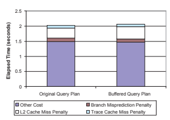

Figure 9: Execution Time Breakdown for Query 2 Figure 11: Cardinality Effects

We use Query 1 as a query template to calibrate our system, in order to determine a cardinality threshold for buffering.

Both queries have similar query plans. The footprint analysis suggests the combined footprint is around 23K bytes, larger than L1 instruction cache size. Therefore, the plan refinement algorithm recommends adding a buffer operator between the operators "TableScan" and "Aggregation".

d T
im e (s eco

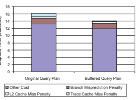

Ela pse nd s)

Figure 10: Execution Time Breakdown for Query 1

198
Figure 10 shows approximate query execution time breakdown for both the original plan and the buffered plan. As expected, the buffered plan reduces the number of trace cache misses by 80%. By improving the instruction locality, the buffered plan also improves the hardware branch predictions and reduces the number of branch mispredictions by 21%. The overhead of extra buffering introduces slightly more L2 cache misses, because the "TableScan" operator needs more memory space to store the buffered intermediate tuples. Though the impact is relatively small, the number of ITLB misses is reduced by 86% as well. The net performance of the buffered plan is 12% faster than the original plan.

## 7.3 Cardinality Effects

There is extra handling for new buffer operators during query execution. More initialization and housekeeping work are involved. As discussed in Section 6, if an execution group is executed only a few times, instruction cache thrashing won't be noticeable.

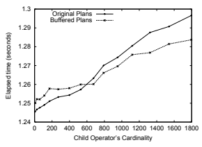

We reexamine Query 1 in Figure 3. Query 1 differs from Query 2 in that it has more complex aggregation functions.

The original query plan is similar to Figure 5(a). The footprints for both the operators "TableScan" and "Aggregation" are small for this query. The combined footprint is around 15K bytes, slightly less than the size of the L1 instruction cache. This suggests that both operators should be in the same execution group and that no buffer operator is necessary between the two operators. We compare the original query plan and a buffered query plan with a buffer operator added between the two operators. The buffered query plan is similar to Figure 5(b). Figure 9 shows the query execution time breakdown. There is no dramatic decrease in trace cache misses for the buffered plan, because the original plan already shows a small number of trace cache misses. The buffered plan incurs slightly more L2 cache misses but slightly fewer branch mispredictions. The net performance of the buffered plan is slightly worse than the original plan. This result confirms (a) that the overhead of buffering is small, and (b) that buffering within a group of operators that already fit in the trace cache does not improve instruction cache performance.

Our experience indicates that the threshold is not very sensitive to the choice of operator. By changing the predicate selectivity in the operator "TableScan", we can control the cardinality of the output of the table scan operator, thus controlling the number of times that the operator "TableS- can" is invoked. Figure 11 shows the query performance of both the original and buffered plans for different cardinalities. Buffered plans get faster than original plans when the cardinalities are larger than 600. Thus, the cardinality threshold discussed in Section 6 would be 600 on the system used for the experiments. In this example, the relative benefits of buffering are small when the predicate is selective. The "TableScan" operator consumes many input tuples to generate one output tuple, and thus there is a relatively large amount of computation (without instruction cache misses) per output tuple. As a result, the contribution of instruction cache misses to the overall cost is small. The benefits of buffering become more obvious as the predicate becomes less selective. In the previous example of Query 1, we achieve a 12% overall improvement when the selectivity is close to 1.

The plans using nested loop joins are shown in Figure 15. For the buffered plan, footprint analysis suggests two execution groups (marked with boxes). Note that there is no buffer operator added above the "IndexScan" operator, even though its footprint is larger than the L1 instruction cache. This is because it is a foreign-key join and the optimizer

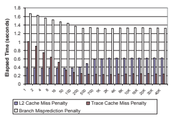

Figure 13: Execution Time Breakdown for Varied Buffer Sizes

199 small, the overhead of buffering is relatively high, and the buffered plan performs slower. As the buffer size increases, the buffered plan shows better performance with better instruction locality. Once the buffer size is larger than 1000, no obvious benefit is shown for even larger buffer sizes.

## 7.4 Buffer Size

Another buffering parameter is the size of array used to buffer tuple pointers. The size is set during operator initialization. The number of reduced trace cache misses is roughly proportional to 1/*buffersize*. Once the buffer is of moderate size, there is only a small incentive to make it bigger.

Figure 13 shows the execution time breakdown for different configurations. The trace cache miss penalty drops as the buffer size increases. Buffer operators incur more L2 data cache misses with large buffer sizes. However, since the data is allocated (or accessed) sequentially, hardware prefetching hides most of the L2 data cache miss latency. These results how that we can achieve good query performance with a moderate buffer size. A disadvantage of large buffer sizes is for query plans which use large data structures, such as an in-memory hash table, index etc. In those cases, a large buffer competes with other data structures for cache memory. Therefore, there is a potential performance drop with an increasing buffer size. We use a buffer size of 1000 in our experiments.

## 7.5 More Complex Queries

We use a two-table join query to demonstrate how buffer operators can be used in more complex situations. Figure 14 shows a query that joins the tables "lineitem" and "order" and lists the total price and the average discount. We explicitly force the optimizer to choose three different join methods. Different query plans have different buffering schemes. SELECT sum(o_totalprice),
count(*), avg(l_discount)
FROM lineitem, orders WHERE l_orderkey = o_orderkey AND l_shipdate <= date '1998-11-01';

#### Figure 14: Query 3

Figure 12: Varied Buffer Sizes Figure 12 shows buffered query performance as a function of the buffer size for Query 1. When the buffer size is very

A bigger buffer size means that the child of the buffer operator requires more memory to store intermediate tuples (the memory requirement for the buffer array itself is comparatively small), and thus incurs more L2 data cache misses. It is tempting to conclude that these L2 misses may be important for large buffer sizes, and to choose a buffer size so that the total memory requirement is less than L2 cache size. However, the intermediate tuples are stored (and retrieved) only once, and that access is usually sequential. As a result, machines such as the Pentium 4, which prefetch ahead of the current reference for sequential access patterns, can hide the memory latency.

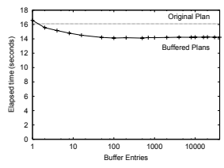

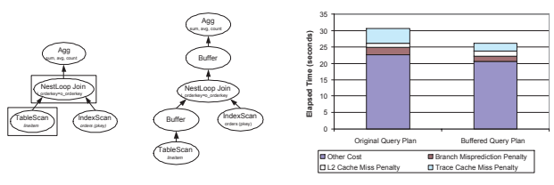

(a) Original Plan (b) Buffered Plan (c) Execution Time Breakdown

200

Figure 15: NestLoop Joins

knows that at most one row that matches each outer tuple. Therefore, no buffer operator is needed. Figure 15(c) shows query execution time breakdown for both the original plan and buffered plan. The buffered plan reduces the trace cache misses by 53% and the branch mispredictions by 26%. Figure 16 shows the plans using a hash join and the query execution time breakdown. The "Hash" operator builds a hash table for the "orders" table on orderkey. The "HashJoin" operator implements the probe phase of the join. Both the build and probe phases are complex enough that they should be considered separately. The build operator, "Hash", is blocking and is not considered in any execution group. The combined footprint of a "TableScan" and either phase is larger than the L1 instruction cache. Therefore, a buffer operator is added for each "TableScan" operator. The buffered plan reduces the trace cache misses by 70% and the branch mispredictions by 44%.

|            | Original Plan   | Buffered Plan   |
|------------|-----------------|-----------------|
| NestLoop   | 2.01            | 1.71            |
| Hash Join  | 1.39            | 1.18            |
| Merge Join | 1.31            | 1.16            |

Figure 17 shows the plans using merge joins and query execution time breakdown. Since the "Sort" operator is blocking, there is no need to add a buffer operator above it. Un-

Table 3: Overall Improvement

Table 4: CPI Improvement For all three join schemes, buffered plans lead to more L2 cache misses. But the overhead is much smaller than the performance gain from the trace cache and branch prediction. The number of ITLB misses is reduced by 60%, 86%, 86% for three join schemes respectively, although the impact of ITLB misses on performance is relatively small. Table 3 shows the overall improvement for the three schemes. Table 4 compares the Cost-Per-Instruction (CPI) for the original and buffered plans. It shows that better instruction cache performance leads to lower CPI. Both the original and buffered plans have almost the same number (less than 1% difference) of instructions executed. This confirms that buffer operators are light-weight.

## 7.6 Tpc-H Queries

We examined all 22 TPC-H queries on Postgres. For most queries, Postgres chooses to use subplans or to materialize the intermediate result for subqueries, which diminishes the benefit of explicit buffering. Also, some queries (such as Query 1) have a very expensive sorting operator, which decreases the percentage gain. Further, for a buffer operator to have noticeable effects, it requires a large output cardinality for its child operator. However, most TPC-H queries are relatively selective.

Nevertheless, Table 5 shows a noticeable improvement for some of the expensive TPC-H queries that do not involve subqueries, and do not have very selective predicates.

| like the nested loop buffered plan in Figure 15(b), we do  add a buffer operator above the "IndexScan" operator. The   |                                      |           | Original Plan           | Buffered Plan   | Improvement   |
|------------------------------------------------------------------------------------------------------------------------|--------------------------------------|-----------|-------------------------|-----------------|---------------|
| buffered plan reduces the trace cache misses by 79% and the  branch mispredictions by 30%.                             |                                      |           | Query 1  71.26 sec      | 66.28 sec       | 7%            |
|                                                                                                                        | Query 5                              | 6.04 sec  |                         | 5.75 sec        | 4%            |
|                                                                                                                        | Query 6                              | 4.02 sec  |                         | 3.62 sec        | 10%           |
| Original Plan                                                                                                          | Query 14  Buffered Plan  Improvement | 13.76 sec |                         | 12.06 sec       | 12%           |
| NestLoop                                                                                                               | 30.64 sec  26.1 sec  15%             |           | Table 5: TPC\-H Queries |                 |               |
| Hash Join                                                                                                              | 12.65 sec  10.72 sec  15%            |           |                         |                 |               |
| Merge Join                                                                                                             | 15.01 sec  13.21 sec  12%            |           |                         |                 |               |

## 8. Conclusion And Future Work

The conventional demand-pull pipeline query execution model suffers from instruction cache thrashing between complex operators. We propose techniques to buffer query execution of query plans to exploit instruction cache spatial and temporal locality. We implement a new buffer operator over the existing open-next-close interface. Our implementation does

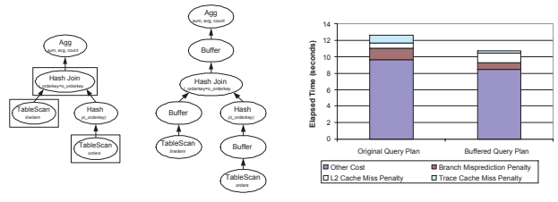

(a) Original Plan (b) Buffered Plan (c) Execution Time Breakdown

201

Figure 16: Hashjoin Joins

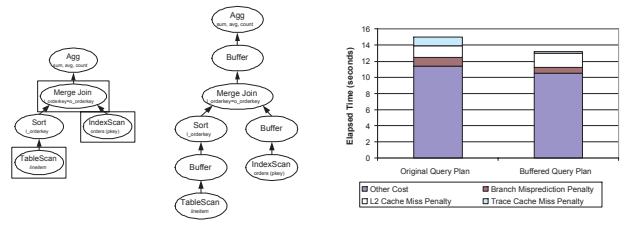

(a) Original Plan (b) Buffered Plan (c) Execution Time Breakdown Figure 17: Merge Joins

not change the implementation of other operators. Buffer operators are especially useful for complex queries which have large instruction footprints and large output cardinalities. Our plan refinement algorithm traverses the query plan in a bottom-up fashion and makes buffering decisions based on footprints and estimated cardinalities. The new buffered plans can reduce instruction cache misses by up to 80% and improve the query performance by up to 15%. One direction for future work is to integrate buffering within the plan generator of a query optimizer. With a suitable detailed cost model, the optimizer can consider instruction cache performance when choosing a optimal plan. We have considered operators as units of buffering. For operators that have very large footprints, it could be beneficial to break the operator into several sub-operators and execute them in stages.

Another direction for future work is to reschedule the execution so that operators that are of the same type are scheduled together for complex query plans. Even though we have to materialize some of the intermediate results, we expect to save instruction cache misses by sharing the instructions between different instances of the same operators.

## 9. References

[1] LMbench - Tools for Performance Analysis.

http://www.bitmover.com/lmbench/.

[2] A. Ailamaki, D. J. DeWitt, M. D. Hill, and M. Skounakis. Weaving relations for cache performance. In *Proceedings of VLDB Conference*, 2001.

[3] A. Ailamaki, D. J. DeWitt, M. D. Hill, and D. A.

Wood. DBMSs on a modern processor: Where does time go? In *Proceedings of VLDB conference*, 1999.

[4] M. Annavaram, J. M. Patel, and E. S. Davidson. Call graph prefetching for database applications. In Proceedings of International Symposium on High Performance Computer Architecture, 2001.

202
[5] L. A. Barroso, K. Gharachorloo, and E. Bugnion.

Memory system characterization of commercial workloads. In *Proceedings of International Symposium* on Computer Architecture, 1998.

[6] P. Boncz, S. Manegold, and M. L. Kersten. Database architecture optimized for the new bottleneck: Memory access. In *Proceedings of VLDB Conference*, 1999.

[7] I.-C. K. Chen, C.-C. Lee, and T. N. Mudge.

Instruction prefetching using branch prediction information. In Proceedings of International Symposium on Microarchitecture, 1997.

[8] S. Chen, P. B. Gibbons, and T. C. Mowry. Improving index performance through prefetching. In Proceedings of ACM SIGMOD Conference, 2001.

[9] S. Chen, P. B. Gibbons, T. C. Mowry, and G. Valentin. Fractal prefetching B+-trees: Optimizing both cache and disk performance. In Proceedings of ACM SIGMOD Conference, 2002.

[10] N. Gloy and M. D. Smith. Procedure placement using temporal-ordering information. ACM Transactions on Programming Languages and Systems, 21(5):977–1027, 1999.

[11] G. Graefe. Volcano, an extensible and parallel query evaluation system. IEEE Transactions on knowledge and data enginnering, 6(6):934–944, 1994.

[12] L. M. Haas et al. Starburst mid-flight: as the dust clears. IEEE Transactions on knowledge and data engineering, 2(1):143, 1990.

[13] A. H. Hashemi, D. R. Kaeli, and B. Calder. Efficient procedure mapping using cache line coloring. In SIGPLAN Conference on Programming Language Design and Implementation, 1997.

[14] G. Hinton, D. Sager, M. Upton, D. Boggs, D. Carmean, A. Kyker, and P. Roussel. The microarchitecture of the Pentium 4 processor. Intel Technology Journal, 1st Quarter, 2001.

[15] Intel Corp. VTune performance analyzer.

http://www.intel.com/software/products/vtune/.

[16] Intel Inc. IA32 intel architecture optimization reference manual. 2003.

[17] K. Keeton, D. A. Patterson, Y. Q. He, R. C. Raphael, and W. E. Baker. Performance characterization of a quad pentium pro smp using oltp workloads. In Proceedings of the 25th International Symposium on Computer Architecture, 1998.

[18] K. Kim, S. K. Cha, and K. Kwon. Optimizing multidimensional index trees for main memory access. In *Proceedings of ACM SIGMOD Conference*, 2001.

[19] C.-K. Luk and T. C. Mowry. Cooperative prefetching:
Compiler and hardware support for effective instruction prefetching in modern processors. In International Symposium on Microarchitecture, 1998.

[20] A. M. G. Maynard, C. M. Donnelly, and B. R.

Olszewski. Contrasting characteristics and cache performance of technical and multi-user commercial workloads. In *Proceedings of International Conference* on Architectural Support for Programming Languages and Operating Systems, 1994.

[21] S. Padmanabhan, T. Malkemus, R. Agarwal, and A. Jhingran. Block oriented processing of relational database operations in modern computer architectures. In *Proceedings of ICDE Conference*, 2001.

[22] S. E. Perl and R. L. Sites. Studies of windows nt performance using dynamic execution traces. In Proceedings of the USENIX Symposium on Operating Systems Design and Implementation, 1996.

[23] K. Pettis and R. C. Hansen. Profile guided code positioning. In Proceedings of ACM SIGPLAN conference, 1990.

[24] A. Ramirez et al. Optimization of instruction fetch for decision support workloads. In Proceedings of the International Conference on Parallel Processing, 1999.

[25] A. Ramirez et al. Code layout optimizations for transaction processing workloads. In Proceedings of International Symposium on Computer Architecture, 2001.

[26] J. Rao and K. A. Ross. Cache conscious indexing for decision-support in main memory. In Proceedings of VLDB Conference, 1999.

[27] J. Rao and K. A. Ross. Making B+ trees cache conscious in main memory. In Proceedings of ACM SIGMOD Conference, 2000.

[28] P. G. Selinger, M. M. Astrahan, D. D. Chamberlin, R. A. Lorie, and T. G. Price. Access path selection in a relational database management system. In Proceedings of ACM SIGMOD Conference, 1979.

[29] A. Shatdal, C. Kant, and J. F. Naughton. Cache conscious algorithms for relational query processing. In *Proceedings of VLDB Conference*, pages 510–521, 1994.

[30] J. Smith and W. C. Hsu. Prefetching in supercomputer instruction caches. In Proceedings of Supercomputing, 1992.

[31] M. Stonebraker, L. A. Rowe, and M. Hirohama. The implementation of Postgres. In Transactions on Knowledge and Data Engineering, 1990.

[32] Transaction Processing Performance Council. TPC
Benchmark H. Available via http://www.tpc.com/tpch/.

[33] J. Zhou and K. A. Ross. Buffering accesses to memory-resident index structures. In Proceedings of VLDB Conference, 2003.